# Tutorial PHP dasar Programmer zaman now

## Pengenalan

- PHP singkatan dari PHP:Hypertext Preprocessor.
- PHP banyak digunakan sebagai bahasa pemrogramman yang dikhususkan untuk web development.
- PHP sangat mudah digunakan dan banyak sekali diadopsi oleh programmer web.
- Bahkan hampir mayoritas kebanyakan web di dunia dibuat menggunakan PHP.
- PHP pertama kali dibuat oleh **Rasmus Lerdorf** pada tahun 1995.

## Open Source

- PHP adalah bahasa pemrogramman yang open source
- Kita bisa download PHP di website [php](https://php.net)
- Atau bisa lihat source code nya di halaman github php [php-src](https://github.com/php/php-src)
- Selain open source, PHP juga free untuk digunakan, sehingga tidak ada biaya yang harus kita keluaran untuk menggunakan PHP

## Proses Development PHP

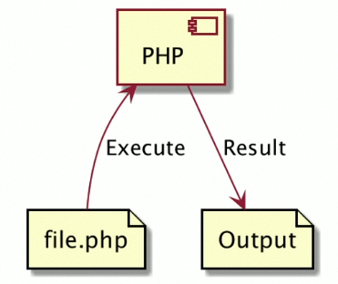

## Apa yang bisa dibuat menggunakan PHP ?

- Server-side scripting. Ini adalah salah satu fokus utama web, untuk membuat aplikasi server side. Biasanya digunakan sebagai aplikasi web menggunakan bantuan web server, dan kita bisa melihat output aplikasi menggunakan web browser (Internet Explorer, Chrome, Firefox, dan lain-lain).
- Command line scripting. PHP juga bisa digunakan untuk membuat program berbasis command line, tanpa harus menggunakan web server.
- Destop application, walaupun jarang digunakan, tapi PHP juga bisa digunakan untuk membuat aplikasi desktop menngunakan PHP-GTK.

## Menginstall PHP

- PHP bisa di install di sistem operasi apapun Windows, Mac maupun Linux.
- Namun menginstall PHP secara manual tidak terlalu mudah.
- Oleh karena itu untuk belajar, direkomendasikan menginstall PHP dengan bantuan tool-tool yang sudah mem-bundle PHP dengan teknologi pendukungnya.

## Menginstall XAMPP

- Pada course ini, kita akan menggunakan aplikasi XAMPP, dimana aplikasi ini telah mem-bundle PHP, MySQL/MariaDB, Apache HTTPD, dan lain-lain.
- [XAMPP](https://www.apachefriends.org/)

## Setting PATH

- Setelah menginstall PHP, kita perlu mengatur PATH sistem operasi yang kita gunakan.
- Tiap sistem operasi berbeda-beda cara setting PATH nya.
- Inti dari setting PATH adalah, agar kita bisa mengakses PHP dari command prompt / terminal.


## Program Hello Wrold

### File PHP

- File kode program PHP diakhiri dengan extention `.php`.
- Di awal kode program PP, wajib menambahkan `<?php`. Dan diakhir kode program php perlu ditambahkan `?>` (tapi tidak wajib).
- Nama file PHP tidak ada aturan, jadi kita bisa membuat file PHP seperti membuat file lain biasanya. Namun agar mempermudah saat menjalankan file PHP, direkomendasikan tidak menggunakan spasi.
- Untuk menampilkan tulias di PHP, kita bisa menggunakan perintah `echo`.

## Tipe Data Number

Di PHP terdapat 2 jenis tipe data number.

- (int) Bilangan bulat decimal (base 10), hexadecimal (base 16), octa (base 8), binary (base 2)
- (float Bilangan pecahan)

Di PHP kita bisa menambahkan (_) (garis bawah) di angka, ini hanya untuk agar mudah dibaca, saat dijalanakan, (_) (garis bawah) akan diabaikan `1_000_000`.

Untuk angka negatif, bisa menggunakan tanda minus (-) di depan angka.

### Kode : Tipe Data Integer

```php
<?php
echo "Decimal : ";
var_dump(1234);

echo "Octal : ";
var_dump(0123);

echo "Hexadecimal : ";
var_dump(0x1A);

echo "Binary : ";
var_dump(0b1111001);

echo "Underscore di Number : ";
var_dump(1_000_000);
?>
```

### Kode : Tipe Data Floating Point

```php
<?php
echo "Floating Point : ";
var_dump(1.234);

echo "Floating Point dengan E notation Plus (1.2 x 1000) : ";
var_dump(1.2e3);

echo "Floating Point dengan E notation Minus (7 x 0.001) : ";
var_dump(7e-3);

echo "Underscore di Floating Point : ";
var_dump(1_000_000.00);
?>
```

### Integer Overflow

- Secara default, kapasitas integer di PHP ada batasannya, 2147483647 untuk sistem operasi 32 bit, dan 9223372036854775807 untuk sistem operasi 64 bit.
- Jika kita membuat number integer yang melebihi nilai tersebut, maka secara otomatis tipe data numbernya akan berubah menjadi floating point.

### Kode : Integer Overflow

```php
<?php
echo "Integer Overflow 32 Bit : ";
var_dump(2147483647);

echo "Integer Overflow 64 Bit : ";
var_dump(9223372036854775807);
?>
```

## Tipe Data Boolean

- Tipe data boolean adalah tipe data yang paling sederhana di PHP.
- Tipe data boolean adalah tipe data dengan nilai kebenaran (benar atau salah).
- Nilai benar direpresentasikan dengan true (case insensitive).
- Nilai salah direpresentasikan dengan false (case insensitive).

### Kode : Tipe Data Boolean

```php
<?php
echo "Benar : ";
var_dump(true);

echo "Salah : ";
var_dump(false);
?>
```

## Tipe Data String

- Tipe data string adalah tipe data representasi dari teks.
- String biasa mengandung kosong atau banyak karakter.

### Single Qoute

Untuk membuat String di PHP, kita bisa menggunakan single qoute.

```php
<?php
echo 'Nama : ';
echo 'Yusril Arzaqi';
?>
```

## Double Qoute

Selain single qoute, kita juga bisa menggunakan double qoute. Salah satu kelebihan menggunakan double qoute adalah, kita menggunakan ecape sequence untuk beberapa hal, seperti \n untuk ENTER, \t untuk TAB, \" untuk double qoute, dan lain-lain.

```php
<?php
echo 'Nama : ';
echo 'Yusril Arzaqi';
echo "\n";

echo "Nama : ";
echo "Yusril\t Arzaqi\n";
?>
```

### Multiline String

- Kadang kita ingin membuat data string yang lebih dari satu baris. Untuk melakukan itu sebenarnya kita bisa menggunakan \n sebagai ENTER.
- Namun PHP memiliki fitur yang lebih baik, yaitu bernama Heredoc dan Nowdoc.

### Heredoc

Heredoc adalah fitur untuk membuat String yang panjang, sehingga kita tidak perlu manual melakukan enter, tab dan yang lain secara manual.

```php
<?php
echo <<<TEKS
Lorem ipsum dolor sit amet,
consectetur adipiscing elit.
Mauris gravida elit quis enim mattis, non commodo purus convallis.
Vestibulum ante ipsum primis in faucibus orci luctus et ultrices posuere cubilia curae;
Nunc at ligula nec risus porttitor blandit.
Sed a tristique ipsum, vitae pretium eros.
Fusce at facilisis neque, eget aliquet purus.
Duis felis neque, viverra in lacinia ut, efficitur a sapien.
TEKS;
?>
```

### Nowdoc

Nowdoc mirip dengan Heredoc, yang membedakan adalah pada Nowdoc tidak memiliki kemampuan parsing seperti di Heredoc datau Double Qoute. Masalah parsing akan kita bahas di materi Manipulasi String.

```php
<?php
echo <<<'TEKS'
Lorem ipsum dolor sit amet,
consectetur "adipiscing" elit.
Mauris gravida elit quis "enim mattis", non commodo purus convallis.
Vestibulum ante ipsum primis in faucibus orci luctus et ultrices posuere cubilia curae;
Nunc at ligula nec risus porttitor blandit.
Sed a tristique ipsum, "vitae pretium eros".
Fusce at facilisis neque, eget aliquet purus.
Duis felis neque, viverra in lacinia ut, efficitur a sapien.
TEKS;
?>
```

## Variable

- Variable adalah tempat untuk menyimpan data sehingga bisa kita gunakan lagi di kode program selanjutnya.
- Di PHP variable bisa menampung berbagai jenis tipe data dan bisa berubah-ubah tipe data.
- Untuk membuat variable kita bisa menggunakan tanda dolar ($) diikuti dengan nama variable nya.
- Penamaan variable tidak boleh mengandung spasi.

### Kode : Variable

```php
<?php
$name = "Yusril";
$age = 18;

echo "Name : ";
echo $name;
echo "\n";
echo "Age : ";
echo $age;
?>
```

### Variable Variables

- PHP memiliki kemampuan variable variables, yaitu membuat variable dari string value variable.
- Walaupun fitur ini ada, tapi fitur ini sangat membigungkan jadi digunakan secara luas, jadi disarankan untuk tidak menggunakan fitru ini kecuali memang diperlukan.
- Untuk membuat variable dari value variable kita bisa menggunakan $$ diikuti dengan nama variable nya.

```php
<?php
$name = "yusril";
$$name = "arzaqi";

echo "\$name = ";
echo $name;
echo "\n";
echo "\$yusril : ";
echo $yusril;
echo "\n";
?>
```

## Constant

- Variable di PHP sifatnya mutable, artinya bisa dirubah.
- Jika kita ingin membuat variable yang imuatable (tidak bisa dirubah), maka tidak bisa kita lakukan di PHP.
- Sebagai gantinya, terdapat fitur yang namanya constant.
- Constant adalah tempat untuk menyimpan data yang tidak bisa dirubah lagi setelah di deklarasikan.
- Untuk membuat constant kit bisa menggunakan function `define()`.
- Best practice pembuatan nama constant adalah menggunakan UPPER_CASE.

### Kode : Constant

```php
<?php
define("AUTHOR", "Yusril Arzaqi");
define("APP_VERSION", "1.0.1");

echo AUTHOR;
echo "\n";
echo APP_VERSION;
echo "\n";

?>
```

## Data NULL

- Nilai `NULL` memrepresentasikan sebuah variable tanpa nilai.
- Saat kita membuat variable, lalu ingin menghapus data yang terdapat di variable tersebut, kita bisa menggunakan `NULL` untuk mengosongkan variable tersebut.
- Untuk membuat data `NULL`, kita bisa menggunakan kata kunci `NULL` (case insensitive).

### Kode : Data NULL

```php
<?php
$name = "Yusril";
$name = NULL;

$age = null;
?>
```

### Mengecek Apakah Data NULL

- Kadang kita ingin tahu apakah sebuah data bernilai null atau tidak.
- Untuk mengecek apakah sebuah nilai data bernilai null, kita bisa menggunakan function `is_null($variable)`.

### Kode : Mengecek NULL

```php
<?php 
$name = "Yusril";
$name = NULL;

$isNull = is_null($name);
var_dump($isNull);
?>
```

### Menghapus Variable

- Selain mengubah menjadi `NULL`, di PHP juga kita biasa menghapus sebuah variable, caranya dengan menggunakan function `unset($variable)`.
- Namun hati-hati, ketika hapus variable, kita tidak bisa lagi mengakses variable tersebut, bahkan function `is_null($variable)` pun akan menjadi error jika mengakses variable tersebut;
- Agar lebih aman, kita bisa menggunakan function `isset($variable)` untuk mengecek apakah sebuah variable ada dan nilainya tidak `NULL`.

## Tipe Data Array

- Array adalah tipe data yang berisikan kosong atau banyak data.
- Array di PHP bisa berisikan data dengan jenis berbeda-beda.
- Array di PHP memiliki panjang dinamis, artinya kita bisa menambah data ke Array sebanyak-banyaknya, tidak dibatasi kapasitasnya.

### Cara Kerja Array

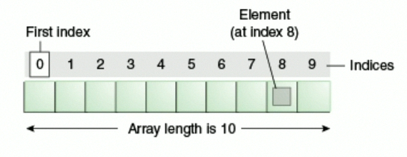

### Kode : Membuat Array

```php
<?php
$values = array(1, 2, 3, 4);
var_dump($values);

// Atau

$names = ["Yusril", "Arzaqi"];
var_dump($names);
?>
```

### Operasi Array

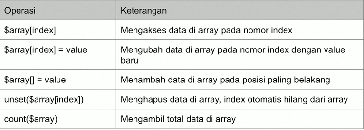

### Kode : Operasi Array

```php
<?php
$name = ["Yusril", "Arzaqi"];
var_dump($name[0]);

$name[0] = "Bimo";
var_dump($name);

unset($name[1]);
var_dump($name);

$name[] = "Alamsyah";

var_dump($name);
var_dump(count($name));
?>
```

### Array Sebagai Map

- Biasanya di kebanyakan bahasa pemrogramman, terdapat tipe data bernama Map, yaitu asosiasi antara key dan value.
- Namun di PHP, Map bisa dibuat menggunakan Array.
- Secara default Array akan menggunakan index (number) sebagai key dan value nya kita bisa bebas memasukan data ke dalam Array.
- Namun jika kita ingin, kita juga bisa mengubah index nya tidak harus menggunakan number, bisa gunakan tipe data lain, seperti string misalnya.
- Hal tersebut terlihat seperti Map di bahasa pemrogramman lain.

### Kode : Membuat Map

```php
<?php
$yusril = array(
  "id" => "yusril",
  "name" => "Yusril Arzaqi",
  "age" => 18
);

$bimo = [
  "id" => "bimo",
  "name" => "Bimo Alamsyah",
  "age" => 18
];
?>
```

### Array di dalam Array

- Seperti dijelaskan di awal, Array di PHP bisa berisikan data apapun.
- Sehingga kita juga bisa membuat array di dalam array jika memang dibutuhkan.

## Operator Aritmatika

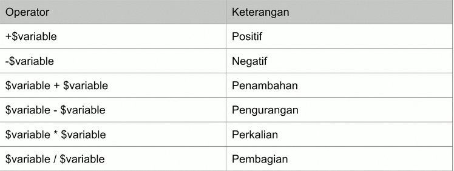

### Kode : Operator Aritmatika

```php
<?php
$result = 10 + 10;
var_dump($result);

$result = 100 % 3;
var_dump($result);
?>
```

## Operator Penugasan

- Operator penugasan di PHP sama seperti bahasa pemrogramman lain, yaitu dengan menggunakan karakter sama dengan (=).
- Operator penugasan sudah sering kita gunakan, terutama ketika mengubah value sebuah variable.
- Namun selain hal itu, operasi penugasan juga bisa digunakan untuk operasi aritmatika.

### Operator Penugasan Aritmatika

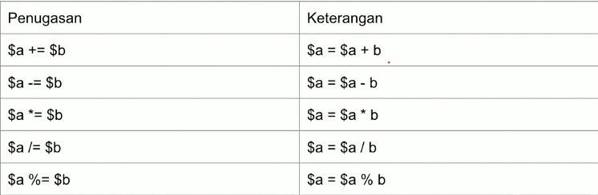

### Kode : Operator Penugasan Aritmatika

```php
<?php
$total = 0;

$fruit = 10_000;
$chicken = 35_000;
$orangeJuice = 1_000;

$total += $fruit;
$total += $chicken;
$total += $orangeJuice;

var_dump($total);
?>
```

## Operator Perbandingan

- Operator perbandingan, seperti namanya, digunakan untuk membandingkan dua buah value.
- Hasil dari operator perbandingan adalah boolean, `true` jika perbandingan benar, `false` jika perbandingan salah.

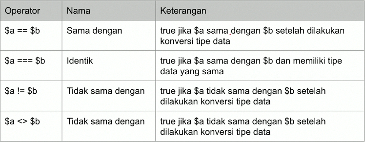

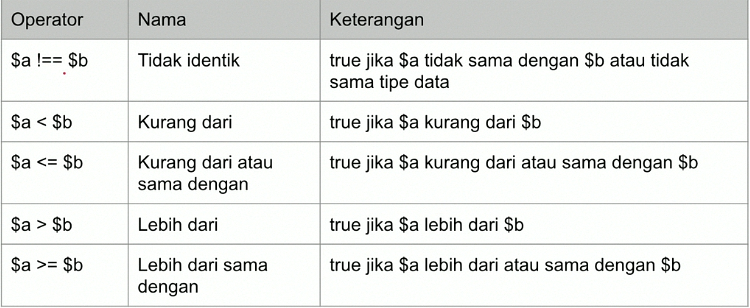

### Kode : Operator Perbandingan

```php
<?php
var_dump("10" == 10); // true
var_dump("10" === 10); // flase

var_dump(10 < 9); // false
var_dump(10 >= 10); // true
?>
```

## Operator Logika

- Operator logika adalah operator untuk membandingkan dua nilai boolean.
- Hasil dari operator logika adalah boolean lagi.

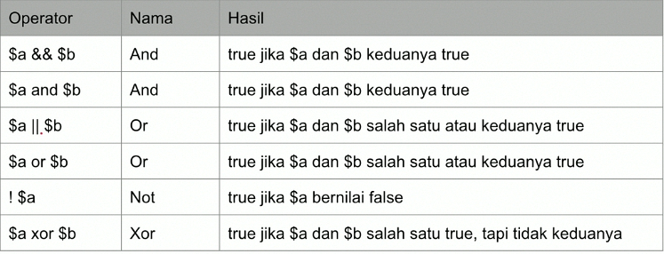

### Kode : Operator Logika

```php
<?php
var_dump(true && true); // true
var_dump(true && false); // false
var_dump(true || false); // true
var_dump(true xor true); // flase
var_dump(!true);
?>
```

## Increment dan Decrement

- PHP mendukung gaya bahasa pemrogramman C untuk menaikkan dan menurunkan data number sejumlah 1 angka.
- Ini bisa mempersingkan kita ketika ingin menaikkan data.

### Operator Increment dan Decrement

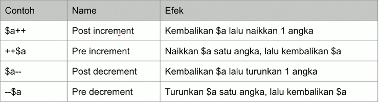

### Kode : Operator Increment dan Decrement

```php
<?php
$a = 10;
$b = ++$a;

var_dump($b);
var_dump($a);
?>
```

## Operator Array

- Di PHP, Array memiliki operator khusus.
- Mungkin terlihat mirip dengan operator-operator sebelumnya, tapi cara kerjanya sedikir berbeda.

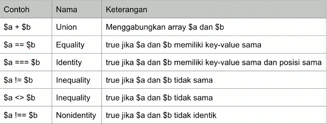

### Kode : Operator Array

```php
<?php
$first = [
  "first_name" => "Yusril"
];

$last = [
  "last_name" => "Arzaqi"
];

var_dump($first + $last);
?>
```

---

```php
<?php
$a = [
  "first_name" => "Yusril",
  "last_name" => "Arzaqi"
];

$b = [
  "last_name" => "Arzaqi",
  "first_name" => "Yusril"
];

var_dump($a == $b);
var_dump($a === $b);
?>
```

## Expression, Statement dan Block

### Expression

- _Expression_ adalah bagian terpenting di PHP.
- Di PHP, hampir semua kode yang kita tulis adalah sebuah _expression_.
- Secara sederhana, _expression_ adalah apapun yang memiliki nilai atau value.

### Contoh Expression Sederhana

- `$a = 5;` Ketika menuliskan `5`, maka tentu itu adalah nilai, oleh karena itu `5` tersebut adalah _expression_.
- Lalu kita menulis kode `$b = $a;`. `$a` bisa kita bilang adalah `expression`, karena `$a` adalah nilai `5`.

```php
<?php
$a = 5;

$b = $a;
?>
```

### Contoh Expression Complex

Pada kode dibawah, `getValue()` adalah _expression_, karena `getValue()` bernilai angka 100. Tentang function nani kit akan bahas lebih detail di materi tersendiri.

```php
<?php
function getValue() {
  return 100;
}

$value = getValue();
?>
```

### Statement

- _Statement_ bisa dibilang adalah kalimat lengkap dalam bahasa.
- Sebuah _statement_ berisikan _execution_ komplit, biasanya diakhiri dengan titik koma.

### Kode : Statement

```php
<?php
$name = "Yusril Arzaqi";

echo $name;

$date = new DateTime();
?>
```

### Block

- _Block_ adalah kumpulan statement yang terdiri dari nol atau lebih _statement_.
- _Block_ diawali dan diakhiri dengan kurung kurawal {}.

## Manipulasi String

### Dot Operator

- _Dot_ (titik) operator adalah operator yang bisa kita gunakan untuk menambahkan string dengan data lain (bisa string ataupun tipe data lainnya).
- Sebenarnya kita bisa menggunakan _plus_ (+) untuk menambahkan string, namun jika kita coba tambahkan string dengan tipe data number, maka akan terjadi error. Oleh karena itu direkomendasikan menggunakan _dot_ (.) untuk menambahkan string dengan data lain.

### Kode : Dot Operator

```php
<?php 
$name = "Yusril Arzaqi";
$nilai = 90;

echo "Nama : " . $name . PHP_EOL;
echo "Nilai : " . $nilai . "\n";
?>
```

### Konvesi ke Number dan Sebaliknya

- Kadang kita sering melakukan konversi data dari String ke number (int/float) atau sebaliknya.
- Di PHP untuk melakukan koversi cukup mudah, kita hanya perlu menggunakan tanda kurung (tipe data).
- Tipe data untuk string adalah string, untuk number bisa menggunakan `int` untuk _integer_ dan `float` untuk _floating point_.

```php
<?php
$valueString = (string)100;
var_dump($valueString);

$valueInt = (int)"100";
var_dump($valueInt);

$valueFloat = (float)"100.11";
var_dump($valueFloat);
?>
```

### Manipulasi Karakter

- _String_ di PHP seperti array karakter, dimana kita bisa mengakses data tiap karakternya menggunakan kurung siku.
- Sama seperti di array, index pertama dimulai dari 0.
- Jika kita mengakses index melebihi karakter di string, maka akan terjadi error.

### Kode : Mengakses Karaketer

```php
<?php
$name = "Hai";

echo $name[0] . PHP_EOL;
echo $name[1] . PHP_EOL;
echo $name[2] . PHP_EOL;
?>
```

### Variable Parsing

- Kusus _string_ menggunakan _double qoute_ atau _heredoc_, kita bisa menggunakan karakter `$` untuk mengakses variable.
- Ini memudahkan ketika kita ingin mengabuhkan string dengan variable.
- Cara penggunaannya adalah dengan menggunakan karakter `$` lalu diikuti dengan nama variable nya.

### Kode : Variable Parsing

```php
<?php
$name = "Yusril";
echo "Hello $name, Selamat belajar PHP". PHP_EOL;
?>
```

### Curly Brace

- Kadang kita butuh menggunakan variable dengan string tanpa ada spasi. Hal ini akan menyulitkan jika hanya menggunakan variable parsing.
- Untungnya di PHP kita bisa menambahkan kurung kurawal sebelum menggunakan variable parsing.

```php
<?php
$var = "var";
echo "This is {$var}s" . PHP_EOL;
?>
```

## If Statement

- Dalam PHP, `if` adalah salah satu kata kunci yang digunakan untuk percabangan.
- Percabangan artinya kita bisa mengeksekusi kode program terentu ketika suatu kondisi terpenuhi.
- Hampir di semua bahasa pemrogramman mendukung _if expression_.

### Syntax If Statement

```php
<?php
if (/* expression */)
  /* statement */

if (/* expression */) {
  /* statement */
  /* statement*/
}
?>
```

### Kode : If Statement

```php
<?php
$nilai = 70;
$absen = 90;

if  ($nilai >= 75 && $absen >= 75) {
  echo "Anda Lulus" . PHP_EOL;
}
?>
```

### Else Statement

- _Blok_ `if` akan dieksekusi ketika kondisi `if` bernilai `true`.
- Kadang kita ingin melakukan eksekusi program tersentu jika konsisi `if` bernilai false.

### Syntax Else Statement

```php
<?php
if (/* expression */)
  /* statement */
else
  /* statement */

if (/* expression */) {
  /* statement */
  /* statement*/
} else {
  /* statement*/
}
?>
```

### Kode : Else Statement

```php
<?php
$nilai = 70;
$absen = 90;

if  ($nilai >= 75 && $absen >= 75) {
  echo "Anda Lulus" . PHP_EOL;
} else {
  echo "Anda Tidak Lulus" . PHP_EOL;
}
?>
```

### Else If Statement

- Kadang dalam `if`, kita butuh membuat beberapa konsisi.
- Kasus seperti ini, di PHP kita bisa menggunakan `else if`
- `else if` di PHP bisa lebih dari satu.
- Kode `else if` di PHP bisa menggunakan `else if` atau `elseif` (digabung).

### Syntax Else If Statement

```php
<?php
if (/* expression */)
  /* statement */
else if
  /* statement */
else
  /* statement */

if (/* expression */) {
  /* statement */
  /* statement*/
} else if (/* expression */){
  /* statement*/
} else {
  /* statement*/
}
?>
```

### Kode : Else If Statement

```php
<?php
$nilai = 70;
$absen = 90;

if  ($nilai >= 80 && $absen >= 80) {
  echo "Nilai Anda A" . PHP_EOL;
} else if  ($nilai >= 70 && $absen >= 70) {
  echo "Nilai Anda B" . PHP_EOL;
} else if  ($nilai >= 60 && $absen >= 60) {
  echo "Nilai Anda C" . PHP_EOL;
} else if  ($nilai >= 50 && $absen >= 50) {
  echo "Nilai Anda D" . PHP_EOL;
} else {
  echo "Nilai Anda E" . PHP_EOL;
}
?>
```

### Syntax Alternatif

- Selain menggunakan kurung kurawal `{}`, PHP juga menyediakan syntax alteratif untuk menggunakan `if`, yaitu dengan menggunakan titik dua `:`.
- Namun untuk menggunakan ini, kita harus menggunakan kata kunci endif diakhir if statement.

### Kode : If Statement Denagn Colon

```php
<?php
if ($nilai >= 80 && $absen >= 80):
  echo "Nilai Anda A" . PHP_EOL;
else if  ($nilai >= 70 && $absen >= 70):
  echo "Nilai Anda B" . PHP_EOL;
else if  ($nilai >= 60 && $absen >= 60):
  echo "Nilai Anda C" . PHP_EOL;
else if  ($nilai >= 50 && $absen >= 50):
  echo "Nilai Anda D" . PHP_EOL;
else:
  echo "Nilai Anda E" . PHP_EOL;
endif;
?>
```

## Switch Statement

- Kadang kita hanya butuh menggunakan kondisi sederhana di if statement, seperti hanya menggunakan perbandingan `==`.
- `switch` adalah _statement_ percabangan yang sama dengan `if`, namun lebih sederhana cara pembuatannya.
- Kondisi di `switch` _statement_ hanya untuk perbandingan `==`.

### Kode : Switch Statement

```php
<?php
$nilai = "A";

switch ($nilai) {
  case "A":
    echo "Anda Lulus dengan sangat baik" . PHP_EOL;
    break;
  case "B":
  case "C":
    echo "Anda Lulus" . PHP_EOL;
    break;
  case "D":
    echo "Anda tidak lulus" . PHP_EOL;
    break;
  default:
    echo "Mungkin Anda salah jurusan" . PHP_EOL;
}
?>
```

### Syntax Alternatif Switch

- Sama seperti `if` _statement_ juga bisa tanpa menggunakan kurung kurawal `{}`.
- Namun diakhiri dengan switch statement, kita harus menambahkan kata kunci `endswitch`.

### Kode : Switch Statement Syntax Alternatif

```php
<?php
$nilai = "A";

switch ($nilai):
  case "A":
    echo "Anda Lulus dengan sangat baik" . PHP_EOL;
    break;
  case "B":
  case "C":
    echo "Anda Lulus" . PHP_EOL;
    break;
  case "D":
    echo "Anda tidak lulus" . PHP_EOL;
    break;
  default:
    echo "Mungkin Anda salah jurusan" . PHP_EOL;
endswitch;
?>
```

## Ternary Operator

- Kadang ada kasus kita butuh melakukan pengecekan kondisi menggunakan `if` _statement_, lalu jika benar kita ingin memberi nilai terhadap variable dengan nilai X dan jika salah dengan nilai Y.
- Penggunaan `if` _statement_ pada kasus seperti bisa dipersingkat menggunakan ternary operator.
- _Ternary_ operator menggunakan kata kunci `?` dan `:`.

### Kode : Bukan Ternary Operator

```php
<?php
$gender = "pira";

$hi = null;

if ($gender ==  "pria") {
  $hi = "Hi Bro!";
} else {
  $hi = "Hi Sis!";
}

echo $hi . PHP_EOL;

?>
```

### Kode : Ternary Operator

```php
<?php
$gender = "pira";
$hi = $gender == "pria" ? "Hi bro!" : "Hi Sis!";

echo $hi . PHP_EOL;
?>
```

## Null Coalescing Operator

- Sebelumnya kita tahu bahwa data kosong direpresentasikan dengan data `null` di PHP.
- Dan hal yang paling repot di PHP dalah mengecek apakah sebuah data ada atau tidak, dan juga apakah data tersebut isinya `null` atau bukan.
- Biasanya untuk melakukan itu, kita perlu menggunakan pengecekan if statement dengan function `isset($variable)`.
- Namun untungnya di php ada **null coalescing operator** menggunakan tanda `??`.

### Kode : Tanpa Null Coalescing Operator

```php
<?php
$data = [];

if (isset($data['action'])) {
  $action = $data["action"];
} else {
  $action = "nothing";
}

echo $action;
?>
```

### Kode : Null Coalescing Operator

```php
<?php
$data = [];
$action = $data['action'] ?? 'nothing';

echo $action;
?>
```

## For Loop

- `for` adalah salah satu kata kunci yang bisa digunakan untuk melakukan perulangan.
- Blok kode yang terdapat di dalam `for` akan selalu diulangi selama kondisi `for` terpenuhi.

### Syntax Perulangan For

```php
<?php
for (init statement;kondisi;post statement) {
  // block perulangan
}
?>
```

- **Init Statement** akan dieksekusi hanya sekali diawal sebelum perulangan.
- **Kondisi** akan dilakukan pengecekan dalam setiap perulangan, jika `true` perulangan akan dilakukan, jika `false` perulangan akan berhenti.
- **Post Statement** akan dieksekusi setiap kali diakhir perulangan.
- **Init Statement**, **Kondisi**, dan **Post Statement** tidak wajib diisi, jika **Kondisi** tidak diisi, berati **Kondisi** selalu bernilai `true`.

### Kode : Perulangan Tanpa Henti

```php
<?php
for(; ;) {
  echo "Infinite Loops" . PHP_EOL;
}
?>
```

### Kode : Perulangan Dengan Kondisi

```php
<?php
$counter = 1;

for(;$counter <= 10 ;) {
  echo "Hello For Loop : $counter " . PHP_EOL;
  $counter++;
}
?>
```

### Kode : Perulangan Dengan Init Statement

```php
<?php

for($counter = 1 ; $counter <= 10 ;) {
  echo "Hello For Loop : $counter " . PHP_EOL;
  $counter++;
}
?>
```

### Kode : Perulangan Dengan Post Statement

```php
<?php

for($counter = 1 ; $counter <= 10 ; $counter++) {
  echo "Hello For Loop : $counter " . PHP_EOL;
}
?>
```

### Kode : Syntax Alternative For Loop

```php
<?php

for($counter = 1 ; $counter <= 10 ; $counter++):
  echo "Hello For Loop : $counter " . PHP_EOL;
endfor;
?>
```

## While Loop

- `while` _loop_ adalah versi perulangan yang lebih sederhana dibanding `for`.
- Di `while`, hanya terdapat kondisi perulangan, tanpa ada init statement dan post statement.

### Kode : While Loop

```php
<?php
$counter = 1;
while ($counter <= 10){
  echo "Hello While Loop : $counter" . PHP_EOL;
  $counter++;
}
?>
```

### Kode : Syntax Alternative While Loop

```php
<?php
$counter = 1;
while ($counter <= 10):
  echo "Hello While Loop : $counter" . PHP_EOL;
  $counter++;
endwhile;
?>
```

### Do While Loop

- `do while` loop adalah perulangan yang mirip dengan while.
- Perbedaannya hanya pada pengecekan kondisi.
- Pengecekan kondisi di `while` loop dilakukan diawal sebelum perulangan dilakukan, sedangkan di `do while` loop dilakukan setelah perulangan dilakukan.
- Oleh karena itu dalam `do while` loop, minimal pasti sekali perulangan dilakukan walaupun kondisi tidak bernilai `true`.

### Kode : Do While Loop

```php
<?php
$counter = 100;

do {
  echo "Hello While Loop : $counter" . PHP_EOL;
  $counter++;
} while($counter <= 10);
?>
```

## Break & Continue

- Pada `switch` statement, kita sudah mengenal kata kunci `break`, yaitu untuk menghentikan `case` dalam `switch`.
- Sama dengan pada perulangan, `break` juga digunakan untuk menghentikan seluruh perulangan.
- Namun berbeda dengan `continue` digunakan untuk menghentikan perulangan saat ini, lalu melanjutkan ke perulangan selanjutnya.

### Kode : Break

```php
<?php
$counter = 1;
while (true) {
  echo "Hello Break : $counter " . PHP_EOL;
  $counter++;

  if ($counter > 10){
    break;
  }
}
?>
```

### Kode : Continue

```php
<?php
for($counter = 0; $counter <= 10; $counter++) {
  if ($counter % 2 == 0) {
    continue;
  }

  echo "Hello Continue odd number : $counter " . PHP_EOL;
}
?>
```

## For Each

- Kadang kita biasa mengakses data array menggunakan perulangan.
- Mengakses data array menggunakan perulangan sangat bertele-tele, kita harus membuat counter, lalu mengakses array menggunakan counter yang kita buat.
- Namun untungnya, di PHP terdapat perulangan `for each`, yang biasa digunakan untuk mengakses seluruh data di array secara otomatis.

### Kode : Tanpa For Each

```php
<?php
$names = [
  "Yusril",
  "Arzaqi"
];

for ($i = 0; $i < count($names); $i++) {
  echo "Hello $names[$i]" .PHP_EOL;
}
?>
```

### Kode : For Each

```php
<?php
$names = [
  "Yusril",
  "Arzaqi"
];

foreach ($names as $name) {
  echo "Hello $name" . PHP_EOL;
}
?>
```

### Kode : For Each dengan Key

```php
<?php
$person = [
  "first_name" => "Yusril",
  "last_name" => "Arzaqi"
];

foreach($person as $key => $value) {
  echo "$key : $value" . PHP_EOL;
}
?>
```

## Goto Operator

- Salah satu fitur yang sebenarnya jarang sekali digunakan di PHP adalah `goto` operator.
- Kenapa jarang digunakan karena jika terlalu banyak menggunakan `goto` operator, kode program aplikasinya akan mudah membigungkan yang membaca kodenya.
- `goto` adalah fitur dimana kita bisa loncat ke kode program sesuai dengan keinginan kita.
- Agar `goto` bisa loncat ke kode program, kita harus membuat label di php dengan menggunakan nama label lalu diakhiri titik dua (:).

### Kode : goto Operator

```php
<?php
goto a;
echo "Hello A" . PHP_EOL;

a:
echo "Hello A" . PHP_EOL;
?>
```

## Function

- `function` adalah block kode program yang akan berjalan saat kita pangil.
- Sebelumnya kita sudah menggunakan `function` `isset()`, `count()` dan lain-lain.
- Untuk membuat `function` di PHP, kita bisa menggunakan kata kunci `function`, lalu diikuti dengan nama `function`, kurung () dan diakhiri dengan block.
- Di bahasa pemrogramman lain, `function` juga disebut dengan _method_.

### Kode : Function

```php
<?php
function sayHello() {
  echo "Hello Function" . PHP_EOL;
}

sayHello();
sayHello();
?>
```

### Lokasi Function

- PHP sangat flexible dalam pembuatan function.
- Tidak seperti pada bahasa pemrogramman lain yang harus ada aturan lokasi dimana membuat function.
- Di PHP kita bebas membuat function dimanapun, bisa di dalam `if` statement, didalam `function`, dan sebagainya.
- Namun perlu diingat, jika kode function yang belum dieksekusi oleh PHP, maka function tersebut tidak akan bisa digunakan.

### Kode : Lokasi Function

```php
<?php
$buat = false;

if ($buat) {
  function hi() {
    echo "Hi" . PHP_EOL;
  }
}

hi();
?>
```

## Function Argument

- Kita bisa mengirim informasi ke function yang ingin kita panggil.
- Untuk melakukan hal tersebut, kita perlu menambahkan argument atau parameter di function yang sudah kita buat.
- Cara membuat argument sama seperti cara membuat variable.
- Argument ditempatkan didalam kurung () di deklarasikan function.
- Argument bisa lebih dari satu, jika lebih dari satu, harus dipisah menggunakan tanda koma.

### Kode : Function Argument

```php
<?php
function sayHello($name) {
  echo "Hello $name" . PHP_EOL;
}

sayHello("Yusril");
sayHello("Bimo");
?>
```

### Default Argument Value

- PHP mendukung default argument value.
- Fitur ini memungkinkan jika ketika kita memanggil function tidak memasukan parameter, kita bisa menentukan data default nya apa.

### Kode : Default Argument Value

```php
<?php
function sayHello($name = "Anonymous") {
  echo "Hello $name" . PHP_EOL;
}

sayHello();
sayHello("Yusril");
?>
```

### Kesalahan Default Argument Value

- Default argument value bisa disimpan argument manapun
- Namun jika argument lebih dari satu, dan kita menyimpan default argument value di parameter awal, maka itu kurang berguna.

### Kode : Kesalahan Default Argument Value

```php
<?php
function sayHello($firstName = "Anonymous", $lastName) {
  echo "Hello $firstName $lastName" . PHP_EOL;
}

sayHello("Yusril");
?>
```

### Type Declaration

- Sama seperti variable, argument di PHP bisa kita masukan data yang dinamis.
- Kadang terlalu dinamis juga menyulitkan jika ternyata kita hanya ingin membuat function yang menggunakan argument dengan tipe data tertentu.
- Untungnya di PHP, kita bisa menambahkan **Type Data** di argument, sehingga PHP akan melakukan pengecekan ketika kita mengirim value ke function tersebut.
- Jika **Type Data Value** tidak sesuai, maka akan terjadi error.
- Secara default PHP akan melakukan percobaan konversi tipe data secara otomatis, misal jika kita menggunakan tipe _int_, tapi kita menggirim string, maka PHP akan otomatis mengkonversi string tersebut menjadi _int_.

### Valid Types

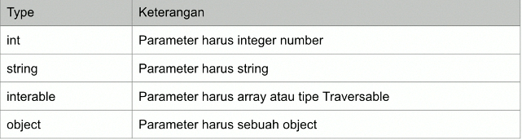

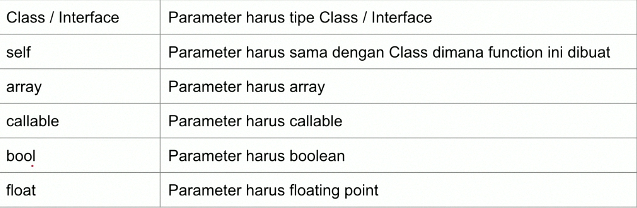

### Kode : Type Declaration

```php
<?php
function sum(int $first, int $last) {
  $total = $first + $last;
  echo "Total $first + $last = $total" . PHP_EOL;
}

sum("100", "100");
sum(100, 100);
sum(true, false);
sum([], []); // akan error
?>
```

### Variable-length Argument List

- **Variable-length argument list** merupakan kemampuan dimana kita bisa membuat sebuah parameter yang menerima banyak value.
- **Variable-length argument list** secara otomatis akan membuat argument tesetbut menjadi array, namun kita tidak perlu manual mengirim array ke functionnya.
- **Variable-length argument list** hanya bisa dilakukan di argument posisi terakhir.
- Untuk membuat **Variable-length argument list**, kita bisa menggunakan tanda `...` (titik tiga kali) sebelum nama argument.

### Kode : Variable-length argument list

```php
<?php
function sumAll(...$values) {
  $total = 0;
  foreach ($values as $value) {
    $total += $value;
  }

  echo "Total " . implode(" + ", $values) . " = $total" . PHP_EOL;
}

sumAll(10, 20, 30, 40);
sumAll(...[10, 20, 30, 40]);
?>
```

## Function Return Value

- Secara default, function itu tidak menghasilkan value apapun, namun jika kita ingin, kita bisa membuat sebuah function mengembalikan nilai.
- Dan di dalam blok function, untuk menghasilkan niali tersebut, kita harus menggunakan kata kunci `return`, lalu diikuti dengan data yang ingin dihasilkan.
- Kita hanya bisa menghasilkan 1 data disebuah function, tidak bisa lebih dari satu.

### Kode : Function Return Value

```php
<?php
function sum(int $a, int $b) {
  return $a + $b;
}

$total = sum(10, 10);
var_dump($total);

$total = sum(20, 20);
var_dump($total);
?>
```

---

```php
<?php
function getFinalValue(int $value) {
  if ($value >= 80) {
    return "A";
  } else if ($value >= 70) {
    return "B";
  } else if ($value >= 60) {
    return "C";
  } else if ($value >= 50) {
    return "D";
  } else {
    return "E";
  }

  echo "Ups" . PHP_EOL;
}
?>
```

### Return Type Declaration

- Sama seperti pada argument, pada return value pun kita bisa mendeklarasikan tipe datanya.
- Hal ini selain mempermudah kita ketika membaca tipe data kembalian function, bisa juga digunakan untuk menjaga jagnan sampai kita mengembalikan tipe data yang salah di function.
- Untuk mendeklarasikan tipe data kembalian function, setelah kurung `()` kita bisa tambahkan `:` diikuti tipe data kembaliannya.

### Kode : Return Type Declaration

```php
<?php
function sum(int $a, int $b): int {
  return $a + $b;
}
?>
```

---

```php
<?php
function getFinalValue(int $value): string {
  if ($value >= 80) {
    return "A";
  } else if ($value >= 70) {
    return "B";
  } else if ($value >= 60) {
    return "C";
  } else if ($value >= 50) {
    return "D";
  } else {
    return "E";
  }

  echo "Ups" . PHP_EOL;
}
?>
```

## Variable Function

- PHP mendukung konsep yang bernama variable function.
- Variable function adalah kemampuan memanggil sebuah function dari value yang terdapat di sebuah variable.
- Untuk menggunakan variable function, kita bisa secara langsung memanggil `$namaVariable()`, jika ingin menambahkan argument, kita bisa menggunakan `$namaVariable(argument)`.

### Kode : Variable Function

```php
<?php
function foo() {
  echo "FOO" . PHP_EOL;
}

function bar() {
  echo "FOO" . PHP_EOL;
}

$functionName = "foo";
$functionName();

$functionName = "bar";
$functionName();
?>
```

### Kode : Penggunaan Variable Function


```php
<?php
function sayHello(string $name, $filter) {
  $finalName = $filter($name);
  echo "Hello $finalName" . PHP_EOL;
}

sayHello("Yusril", "strtoupper");
sayHello("Yusril", "strtolower");
?>
```

## Anonymous Function

- Anonymous function adalah function tanpa nama, di PHP disebut juga dengan **Closure**.
- Anonymous function biasanya digunakan sebagai argument atau sebagai value di variable.
- Anonymous function membuat kita bisa mengirim function sebagai argument di function lainnya.

### Kode : Anonymous Function

```php
<?php
$sayHello = function (string $name) {
  echo "Hello $name" . PHP_EOL;
};

$sayHello("Yusril");
$sayHello("Bimo");
?>
```

### Kode : Anonymous Function Sebagai Argument

```php
<?php
function sayHello(string $name, $filter) {
  $finalName = $filter($name);
  echo "Hello $finalName" . PHP_EOL;
}

sayHello("Yusril", function(string $name) {
  return strtoupper($name);
});
?>
```

### Mengakses Variable di Luar Closure

- Secara default, anonymous function tidak bisa mengakses variable yang terdapat diluar function.
- Jika kita ingin menggunakan variable yang terdapat diluar anonymous function, kita perlu secara explisit menyebutkannya menggunakan kata kunci `use` lalu diikuti variable-variable yang ingin kita gunakan.

### Kode : Mengakses Variable Luar

```php
<?php
$firstName = "Yusril";
$lastName = "Arzaqi";

$sayHello = function() use ($firstName, $lastName) {
  echo "Hello $firstName $lastName" . PHP_EOL;
};

sayHello();
?>
```

## Arrow Function

- Arrow function diperkenalkan di PHP 7.4 sebagai alterative anonymous function yang lebih sederhana pembuatannya.
- Secara garis besar, sebenarnya arrow function dan anonymous function adalah dua hal yang sama.
- Hal yang membedakan di arrow function adalah, secara otomatis variable diluar closure bisa digunakan, tidak seperti di anonymous function yang harus disebutkan secara manual menggunakan kata kunci `use`.
- Pembuatan arrow function tidak menggunakan kata kunci function, melainkan `fn`.
- Arrow function di khususkan untuk pembuatan function yang sederhana.

### Kode : Arrow Function


```php
<?php
$firstName = "Yusril";
$lastName = "Arzaqi";

$sayHello = fn() => "Hello $firstName $lastName" .PHP_EOL;

echo $sayHello();
?>
```

## Callback Function

- **Callback** adalah sebuah mekanisme sebuah function memanggil function sesuai dengan yang diberikan di argument.
- Hal ini sebenarnya sudah kita lakukan di materi **Variable Function** dan **Anonymous Function**.
- Namun di PHP ada cara lain untuk impementasi **callback**, yaitu dengan menggunakan tipe data **callable**.
- Dan untuk memanggil function tersebut, kita bisa menggunakan function `call_user_func(callable, arguments)`.

### Kode : Callback Function

```php
<?php
function sayHello(string $nama, callable $filter) {
  $result = call_user_func($filter, $name);
  echo "Hello $result" . PHP_EOL;
}

sayHello("Yusril",function($name) {
  return strtoupper($name); 
});

sayHello("Yusril", fn($name) => strtoupper($name));

sayHello("Yusril", "strtoupper");
?>
```

## Recursive Function

- **Recursive Function** adalah komampuan function untuk memanggil function dirinya sendiri.
- Kadang memang ada banyak problem, yang lebih mudah diselesaikan menggunakan **recursive function**, seperti contohnya kasus factorial.

### Kode : Factorial Loops

```php
<?php
function factorialLoop(int $value): int {
  $total = 1;
  for ($i = 1; $i <= $value; $i++) {
    $total *= $i;
  }
  return $total;
}

var_dump(factorialLoop(5));
?>
```

### Problem Dengan Recursive

- Walaupun recursive function itu sangat menarik, namun kita perlu berhati-hati.
- JIka recursive terlalu dalam, maka akan ada kemungkinan terjadi memory _overflow_, yaitu _error_ dimana memory terlalu banyak digunakan di PHP.
- Kenapa problem ini bisa terjadi? Karena ketika kita memanggil function, PHP akan menyimpannya dalam stack, jika function tersebut memanggil function lain, maka stack akan menumpuk terus, dan jika terlalu banyak, maka akan membutuhkan alokasi memory yang besar, jika sudah melewati batas, maka akan terjadi _error memory_.

### Kode : Error StackOverflow

```php
<?php
function loop(int $value) {
  if ($value == 0) {
    echo "selesai!" . PHP_EOL;
  } else {
    echo "Loop-$value" . PHP_EOL;
    loop($value - 1);
  }
}

loop(30000000);

?>
```

## Komentar

- Kadang dalam membuat program, kita sering mendapatkan komentar dikode program tersebut.
- Komentar adalah kode program yang akan dihiraukan saat kode program kita dijalankan.
- Biasanya komentar digunakan untuk dokumentasi.

### Kode : Komentar

```php
<?php
/*
  Komentar Multi baris,
  bisa untuk lebih dari
  satu baris
 */

function foo() {
  // komentar satu baris
  echo "foo" . PHP_EOL;
}
?>
```

## String Function / Method

- Sebelumnya saya pernah menggunakan beberapa function bawaan dari PHP untuk memanipulasi data string.
- Sebelumnya banyak sekali function bawaan PHP yang bisa kita gunakan untuk memanipulasi string.
- [String Method](https://www.php.net/manual/en/ref.strings.php)

### Contoh String Function / Method


### Kode : String Function

```php
<?php
var_dump(join(" ", [1, 2, 3, 4, 5]));

var_dump(explode(" ", "Yusril Arzaqi"));

var_dump(strtolower("YUSRIL ARZAQI"));

var_dump(strtoupper("yusril arzaqi"));

var_dump(trim("               yusril             "));

var_dump(substr("Yusril Arzaqi", 0, 3));
?>
```

## Array Function / Method

- Di PHP juga terdapat banyak sekali function bawan yang bisa kita gunakan untuk memanipulasi data array.
- [Array Function](https://www.php.net/manual/en/ref.array.php)

### Contoh Array Function / Method

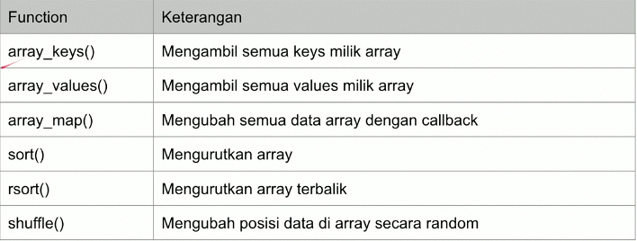

```php
<?php
$data = [
  1, 2, 3, 4, 5, 6, 7, 8, 9, 10
];

var_dump(array_map(fn($data) => $data * 2, $data));

rsort($data);
var_dump($data);


var_dump(array_keys($data));

var_dump(array_values($data));
?>
```

## Is Function

- PHP memiliki banyak sekali function dengan prefix `is_`.
- Function-function ini rata-rata digunakan untuk mengecek tipe data dari sebuah data.
- [Is Function](https://www.php.net/manual/en/ref.var.php)

### Contoh Is Function

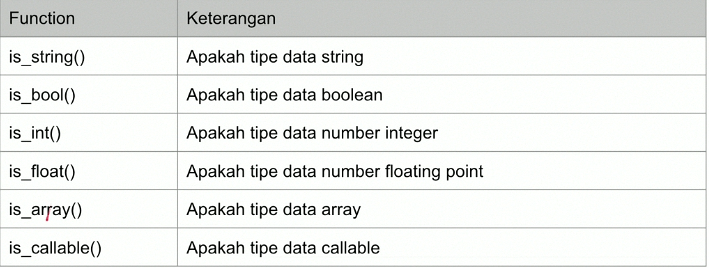

### Kode : Is Function

```php
<?php
$data = "Yusril";

var_dump(is_string($data));
var_dump(is_bool($data));
var_dump(is_int($data));
var_dump(is_float($data));
var_dump(is_array($data));
var_dump(is_null($data));
?>
```

## Require dan Include

- Saat membuat aplikasi, ada bainya tidak dibuat dalam satu file.
- Lebih baik dipisah ke berbeda file agar kode program tidak terlalu bertumpuk di satu file.
- PHP memiliki function `require` dan `include` yang bisa kita gunakan untuk mengambil file php lain.
- Lantas apa bedanya `require` dan `include`?
- Pada `require`, jika file yang kita ambil tidak ada, maka akan terjadi _error_ dan program terhenti.
- Pada `include`, jika file kita ambil tidak ada, maka hanya akan memberi peringatan, namun program akan tetap dilanjutakan.

### Kode : File MyFunction.php

```php
<?php
function sayHello(string $firstName, string $lastName): string {
  return "Hello $firstName $lastName";
}
?>
```

### Kode : Include

```php
<?php
include "MyFunction.php";
require "MyFunction.php";

echo sayHello("Yusril", "Arzaqi");
?>
```

### Posisi Require dan Include

- Kode program PHP akan dibaca dari atas ke bawah, oleh karena itu pastikan posisi `require` dan `include` sesuai dengan yang kita inginkan.
- Misal jika sampai kita salah menempatkan posisi `require` dan `include`, bisa jadi kita malah memanggil function yang belum ada.

### require_once dan include_once

- Function `require` dan `include` akan selalu mengambil file yang kita inginkan.
- Jika kita beberapa kali menggunakan `require` dan `include` file yang sama, maka file tersebut akan beberapa-kali pula kita ambil.
- Hal ini akan menjadi masalah jika misal dalam file yang kita ambil terdapat definisi function, sehingga jika kita ambil berkali-kali akan menyebabkan _error redeclare function_.
- Untungnya di PHP terdapat function `require_once` dan `include_once`, function ini bisa mendeteksi jika kita sebelumnya pernah mengambil file yang sama, maka tidak akan diambil lagi.

### Kode : Include Berkali-kali

```php
<?php
include "MyFunction.php";
include "MyFunction.php";

echo sayHello("Yusril", "Arzaqi");
?>
```
### Kode : include_once 

```php
<?php
include_once "MyFunction.php";
include_once "MyFunction.php";

echo sayHello("Yusril", "Arzaqi");
?>
```

## Variable Scope

- DI PHP, kita bisa membuat variable dimanapun yang kita mau.
- Scope variable adalah dibagian mana saja sebuah variable bisa diakses.
- PHP memiliki tiga jenis variable scope.

  * global
  * local
  * static

### Global Scope

- Variable yang dibuat diluar function memiliki scope global.
- Variable di scope global hanya bisa diakses dari luar function.
- Artinya di dalam function, kita tidak bisa mengakses variable di global scope.

### Kode : Variable Global Scope

```php
<?php
$global = "Global"; // global

function foo() {
  echo $global; // error
}

foo();
?>
```

### Local Scope

- Variable yang dibuat di dalam function memiliki scope local.
- Variable di scope local hanya bisa diakses dari dalam function itu sendiri.
- Artinya variable tersebut tidak bisa diakses dari luar function ataupun dari function lain.

### Kode : Variable Local Scope

```php
<?php
function foo() {
  $foo = "foo"; //local scope
}

foo();
echo $foo; //error
?>
```

### Global Keyword

- Namun jika kita ingin mengakses variable diluar function (global scope) dari dalam function, kita bisa menggunakan kata kunci `global`.
- Dengan menggunakan kata kunci `global`, maka kita bisa mengakses variable yang ada di global scope dari dalam function.

### Kode : Global Keyword

```php
<?php
$global = "Global"; // global

function foo() {
  global $global;
  echo $global; // error
}

foo();
?>
```

### $GLOBALS Variable

- Selain menggunakan global keyword, setiap variable yang dibuat global scope, secara otomatis akan disimpan di dalam array `$GLOBALS` oleh PHP.
- Jadi kita bisa menggunakan `$GLOBALS` variable dengan key nama variable nya dari dalam function jika ingin mengakses global variable.
- `$GLOBALS` adalah variable yang bersifat superglobal, artinya bisa diakses dari scope manapun;

###  Kode : $GLOBALS Variable

```php
<?php
$global = "Global"; // global

function foo() {
  echo $GLOBALS["global"] . PHP_EOL;
}

foo();
?>
```

### Static Scope

- Secara default local variable itu siklus hidupnya hanya sebatas function nya dieksekusi.
- Jika sebuah function selesai dieksekusi, maka siklus hidupnya local variable nya selesai.
- PHP memiliki scope yang bernama static.
- **Static Scope** hanya bisa di set ke local variable.
- Saat kita membuat local variable menjadi static, maka siklus hidupnya tidak akan berhenti ketika sebuah function selesai dieksekusi.
- Artinya jika function tersebut dieksekusi lagi, maka static variable tersebut akan memiliki value dari sebelumnya.

### Kode : Static Scope

```php
<?php
function increment() {
  static $counter = 1;
  echo "Counter : $counter" . PHP_EOL;

  $counter++;
}

increment();
increment();
increment();
increment();
?>
```

## Refrence

### Apa itu Refrence ?

- **Refrence** adalah variable yang sama dengan nama variable yang berbeda.
- **Refrence** di PHP tidak sama dengan refrence di bahasa pemrogramman seperti C/C++ yang memiliki fitur pointer.
- Analogi **Refrence** itu seperti file, jika variable adalah file, dan value nya dalah isi file nya, maka refrence adalah memuat shortcut (di Windows) atau alias (di Linux/Mac) terhadap file yang sama.
- Saat kita mengubah isi value dari refrence, maka secara otomatis value variable aslinya pun berubah.
- Untuk membuat refrence terhadap variable, kita bisa menggunakan karakter `&`.

### Assign By Refrence

- Pertama, PHP Refrence bisa memungkinkan kita membuat beberapa variable menuju ke value yang sama.

### Kode : Assign By Refrence

```php
<?php
$name = "Yusril";

$otherName = &$name;
$otherName = "Bimo";

echo $name . PHP_EOL;
?>
```

### Pass By Refrence

- Selanjutnya yang bisa dilakukan di PHP adalah, mengirim data ke function dengan refrence.

### Kode : Pass By Refrence

```php
<?php
function increment(int &$value) {
  $value++;
}

$counter = 1;
increment($counter);

echo $counter . PHP_EOL;
?>
```

### Returning Refrence

- PHP juga bisa mengembalikan refrence pada function.
- Namun hati-hati, gunakan fitur ini jika memang ada alsannya, karena fitur ini bisa membigungkan.

### Kode : Returning Refrence

```php
<?php
function &getValue(){
  static $value = 100;
  return $value;
}

$a = &getValue();
$a = 250;

$b = &getValue();
echo $b . PHP_EOL;
?>
```

## Materi Selanjutnya

- PHP Object Oriented Programming
- PHP Database
- PHP Web
- PHP Composer
- PHP Uint Test

