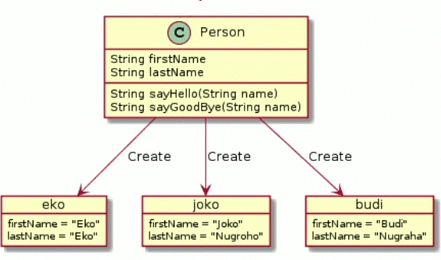
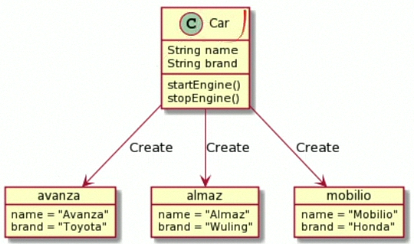
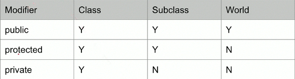
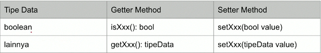
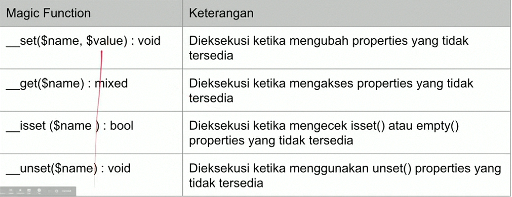
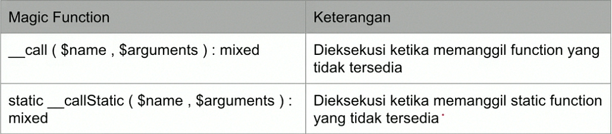
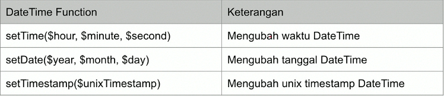
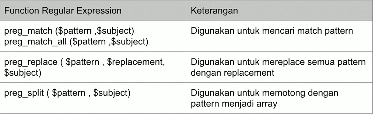

# Programer Zaman Now OOP

## Agenda

- Pengenalan Object Oriented Programming.
- Class, Object.
- Inheritance, Polymorphism, Getter, Setter.
- Interface, Trait, static, stdClass, Generator, Object Cloning, Comparing Object, Magic Function.
- Properties Overloading, Function Overloading.
- Covariance & Contravariance.
- DateTime, DateInterval, DateTimeZone, Format DateTime, Parse DateTime.
- Exception, Try, Catch.
- Regular Expression.
- Reflection.
- Error.
- Dan lain-lain.

## Pengenalan OOP

### Apa itu Object Oriented Programming ?

- **Object Oriented Programming** adalah sudut pandang bahasa pemrograman yang berkonsep **Object**.
- Ada banyak sudut pandang bahasa pemrograman, namun OOP adalah yang sangat populer saat ini.
- Ada banyak istilah yang perlu dimengerti dalam OOP, yaitu **Object** dan **Class**.

### Apa itu Object ?

- **Object** adalah data yang berisi _field_ / _properties_ / _attribute_ / dan _method_ / _function_ / _behavior_

### Apa itu Class ?

- **Class** adalah _blueprint_, _prototype_ atau cetakan untuk membuat **Object**.
- **Class** berisikan deklarasi semua properties dan function yang dimiliki oleh **Object**.
- Setiap **Object**  selalu dibuat dari **Class**.
- Dan sebuah **Class** bisa membuat **Object** tanpa batas.

### Class dan Object : Person



### Class dan Object : Car



## Class

### Membuat Class

- Untuk membuat class, kita bisa menggunakan kata kunci `class`.
- Penamaan `class` biasa menggunakan format **CamelCase**.

### Kode : Class

```php
<?php
class Person {

}
?>
```

## Object

### Membuat Object

- Object adalah hasil instansiasi dari sebuah class
- Untuk membuat object kita bisa menggunakan kata kunci `new`, dan diikuti dengan nama **Class** dan kurung `()`.

### Kode : Object

```php
<?php
require_once "data/Person.php";

$person = new Person();
var_dump($person);
?>
```

## Properties

- **Fields** / **Properties** / **Attribute** adalah data yang bisa kita sisipkan di dalam Object.
- Namun sebelum kita bisa memasukkan data di fields, kita harus mendeklarasikan data apa saja yang dimiliki object tersebut di dalam deklarasi class-nya.
- Membuat field sama seperti mambuat variable, namun ditempatkan di block class, namun diawali dengan kata kunci `var`.

### Kode : Properties

```php
<?php
class Person {
  var $name;
  var $address;
  var $country;
}
?>
```

### Manipulasi Properties

- **Fields** yang ada di object, bisa kita manipulasi.
- Untuk memanipulasi data field, sama seperti cara pada variable.
- Untuk mengakses field, kita bituh kata kunci `->` setelah nama object dan diikuti nama fields nya.

### Kode : Memanipulasi Properties

```php
<?php
$person = new Person();
$person->name = "Yusril";
$person->address = "Semarang";
$person->country = "Indonesia";

echo "Name    : {$person->name}" . PHP_EOL;
echo "Address : {$person->address}" . PHP_EOL;
echo "Country : {$person->country}" . PHP_EOL;
?>
```

### Properties Type Declaration

- Sama seperti di function, di properties pun, kita bisa membuat _type declaration_.
- Ini mambuat PHP otomatis mengecek data yang sesuai dengan _type declaration_ yang telah ditentukan.
- Jika kita mencoba mengubah properties dengan type yang berbeda, maka otomatis akan error.
- Ingat bahwa PHP memiliki fitur _type juggling_, yang secara otomatis bisa mengkonversi ke tipe data lain.
- Untuk menambahkan _type declaration_, kita bisa tambahkan setelah kata kunci `var` di properties.

### Kode : Properties dengan Type

```php
<?php
class Person{
  var string $name;
  var string $address;
  var string $country;
}
?>
```

### Default Properties Value

- Sama seperti variable, di properties juga kita bisa langsung mengisi value nya.
- Ini mirip seperti default value, jadi jika tidak diubah di object, maka properties akan memiliki value tersebut.

### Kode : Properties Default Value

```php
<?php
class Person{
  var string $name;
  var string $address;
  var string $country = "Indonesia";
}
?>
```

### Nullable Properties

- Saat kita menambah _type declaration_ di properties atau di function argument, maka secara otomatis kita tidak bisa mengirim data `null` ke dalam properties atau function argument tersebut.
- Di PHP 7.4 dikenalkan _nullable type_, jadi kita bisa mengirim data `null` ke properties atau function argument.
- Caranya sebelum _type declaration_ nya, kita bisa tambahkan tanda `?`.

### Kode : Nullable Properties

```php
<?php
class Person{
  var string $name;
  var ?string $address = null;
  var string $country = "Indonesia";
}
?>
```

## Function

- selain menambahkan properties, kita juga bisa menambahkan function ke object.
- Cara dengan mendeklarasikan function tersebut di dalam block `class`.
- Sama seperti function biasanya, kita juga bisa menambahkan `return` value dan parameter.
- Untuk mengakses function tersebut, kita bisa menggunakan tanda `->` dan diikuti dengan nama methodnya. Sama seperti mengakses properties.

### Kode : Function

```php
<?php
class Person{
  var string $name;
  var string $address;
  var string $country;

  function sayHello(string $name) {
    echo "Hello $name" . PHP_EOL;
  }
}
?>
```

## this Keyword

- Saat kita membuat kode di dalam function di dalam class, kita bisa menggunakan kata kunci `this` untuk mengakses object saat ini.
- Misal kadang kita butuh mengakses properties atau function lain di class yang sama.

### Kode : This Keyword

```php
<?php
function sayHello(?string $name) {
  if (is_null($name)) {
    echo "Hi, my name is {$this->name}" . PHP_EOL;
  } else {
    echo "Hello $name, my name is {$this->name}" . PHP_EOL;
  }
}
?>
```

## Constant

- Properties di class bisa diubah, mirip seperti variable.
- Di class juga kita bisa membuat constant, data yang tidak bisa diubah.
- Di materi PHP Dasar, kita belajar untuk membuat constant itu perlu menggunakan function `define();`.
- Namun sejak PHP 7.4, kita bisa menggunakan kata kunci `const` untuk membuat constant, mirip seperti variable, namun tidak menggunakan karakter `$`.

### Kode : Constant

```php
<?php
define('APPLICATION', "Belajar PHP OOP");
const APP_VERSION = "1.0.0";

echo APPLICATION. PHP_EOL;
echo APP_VERSION . PHP_EOL;
?>
```

### Kode : Constant di Class

```php
<?php
class Person {
  const AUTHOR = "Yusril Arzaqi";

  var string $name;
  var ?string $address = null;
  var string $country = "Indonesia";
}
?>
```

### Kode : Mengakses Constant di Class

```php
<?php
echo Person::AUTHOR . PHP_EOL;
?>
```

## Self Keyword

### Properties vs Constant

- Saat kita membuat object, properties yang terdapat di class akan secara otomatis dibuat per object, oleh karena itu untuk mengakses properties, kita perlu menggunakan object, atau jia dari dalam object tersebut sendiri, kita perlu menggunakan kata kunci `this`.
- Sedangkan berbeda dengan **Constant**, **Constant** di class tidak akan dibuat per object. **Constant** itu hidupnya di class, bukan di object, oleh karena itu untuk mengakses kita perlu menggunakan `NamaClass:NAMA_CONSTANT`.
- Secara sederhana, properties akan dibuat satu per instance class (object), sedangkan constant dibuat satu per satu.

### self Keyword

- Jika di dalam class (misal di function) kita ingin mengakses constant, kita perlu mengakses meggunakan `NamaClass:NAMA_CONSTANT`.
- Namun jika di dalam class yang sama, kita bisa menggunakan kata kunci `self` untuk mempermudah.

### Kode : self Keyword

```php
<?php
class Person {
  const AUTHOR = "Yusril Arzaqi";

  function info() {
    echo "AUTHOR : " . self::AUTHOR . PHP_EOL;
  }
}
?>
```

## Constructor

- Saat kita membuat Object, maka kita seperti memanggil sebuah function, karena kita menggunakan kurung `()`.
- Di dalam class PHP, kita bisa membuat **Constructor**, **Constructor** adalah function yang akan dipanggil saat pertama kali Object dibuat.
- Mirip seperti di function, kita bisa memberi parameter pada **Constructor**.
- Namun **Constructor** di PHP haruslah `__construct()`.

### Kode : Membuat Constructor

```php
<?php
class Person {
  const AUTHOR = "Yusril Arzaqi";

  var string $name;
  var ?string $address = null;
  var string $country = "Indonesia";
  
  public function __construct(string $name, ?string $address) {
    $this->name = $name;
    $this->address = $address;
  }
}
?>
```

### Kode : Menggunakan Constructor

```php
<?php 
require 'data/Person.php';

$yusril = new Person("Yusril", "Semarang");
$yusril->country = "Indonewsia";

$yusril->sayHello("Bimo");
$yusril->sayHello(null);
?>
```

## Destructor

- Jika **Constructor** adalah function yang akan dipanggil ketika object dibuat.
- Maka **Destructor** adalah function yang akan dipanggil ketika object dihapus dari memory.
- Biasanya ketika object tersebut sudah tidak lagi digunakan, atau ketika aplikasi akan mati.
- Untuk membuat function destructor, kita bisa menggunakan nama function `__destruct()`.
- Khusus untuk **Destructor**, kita tidak boleh menambahkan function argument.
- Dalam penggunaan sehari-hari, ini misal cocok untuk menutup koneksi ke database atau menutup proses menulis ke file, sehingga tidak terjadi memory leak.

### Kode : Destructor

```php
<?php
class Person {
  function __destruct() {
    echo "Object person {$this->name} is destroyed" . PHP_EOL;
  }
}
```

## Inheritance

- **Inheritance** atau pewarisan adalah kemampuan untuk menurunkan sebuah class ke class lain.
- Dalam artian, kita bisa membuat class **Parent** dan class **Child**.
- Class **Child**, hanya bisa punya satu class **Parent**, namun class Parent bisa punya banyak class **Child**.
- Sebuah class diturunkan, maka semua properties dan method yang ada di class **Parent**, secara otomatis akan dimiliki oleh class Child.
- Untuk melakukan pewarisan, di class **Child**, kita harus menggunakan kata kunci `extends` lalu diikuti dengan nama class parentnya.

### Kode : Inheritance

```php
<?php
class Manager {
  var string $name;

  function sayHello(string $name) {
    echo "Hi $name, my name is $this->name" . PHP_EOL;
  }
}

class VicePresident extends Manager {

}
?>
```

### Kode : Mengakses Method Parent

```php
<?php
$manager = new Manager();
$manager->name = "Yusril";
$manager->sayHello("Bimo");

$vp = new VicePresident();
$vp->name = "Bimo";
$vp->sayHello("Yusril");
?>
```

## Namespace

- Saat kita membuat aplikasi, bisa dipastikan kita akan banyak sekali membuat class.
- Jika class terlalu banyak, kadang akan menyulitkan kita untuk mencari atau mengklasifikasikan jenis-jenis class.
- PHP memiliki fitur namespace, dimana kita bisa menyimpan class-class kita didalam `namespace`.
- Namespace bisa nasted, dan jika kita ingin mengakses class yang terdapat di namespace, kita perlu menyebutkan nama namespace nya.
- Namespace bagus ketika kita punya beberapa class yang sama, dengan menggunakan namespace nama class sama, tidak akan menjadikan error di PHP.

### Kode : Tanpa Namespace

```php
<?php
class Conflict {

}

class Conflict {

}
?>
```

### Membuat Namespace

- Untuk membuat namespace, kita bisa menggunakan kata kunci `namespace`.
- Jika kita ingin membuat sub namespace, kita cukup gunakan karakter `\` setelah namespace sebelumnya.

### Kode : Membuat Namespace

```php
<?php
namespace Data\One {
  class Conflict {

  }
}

namespace Data\Two {
  class Conflict {

  }
}
?>
```

### Kode : Membuat Object dari Namespace

```php
<?php
require_once "data/Conflict.php";

$conflict1 = new \Data\One\Conflict();
$conflict2 = new \Data\Two\Conflict();
?>
```

### Function dan Constant di Namespace

- Selain class, kita juga menggunakan function dan constant di namespace.
- Dan jika kita ingin menggunakan function atau constant tersebut, kita bisa menggunakannya dengan diawali dnegan nama namespacenya.

### Kode : Function dan Constant di Namespace

```php
<?php
namespace Helper {
  function helpMe() {
    echo "HELP ME" . PHP_EOL;
  }

  const APPLICATION = "Belajar PHP OOP";
}
?>
```

### Global Namespace

- Secara default saat kita membuat kode di PHP sebenarnya itu disimpan di global namespace.
- **Global namespace** adalah namespace yang tidak memiliki nama namespace.

### Kode : Global Namespace

```php
<?php
namespace {
  echo "Hello Global Namespace" . PHP_EOL;
}
?>
```

## Import

### use Keyword

- Sebelumnya kita sudah tahu bahwa untuk menggunakan class, function atau constant di namespace kita perlu menyebutkan nama namespace nya di awal.
- Jika terlalu sering menggunakan class, function atau constant yang sama, maka terlalu banyak duplikasi dengan menyebut namespace yang sama berkali-kali.
- Hal ini bisa kita hindari dengan cara mengimport class, function atau constant tersebut dengan menggunakan kata kunci `use`.

### Kode : use Keyword

```php
<?php
require_once  "data/Conflict.php";
require_once  "data/Helper.php";

use Data\One\Conflict;
use function Helper\helpMe;
use const Helper\APPLICATION;


$conflict1 = new Conflict();
$conflict2 = new Data\Two\Conflict();

helpMe();
echo APPLICATION . PHP_EOL;
?>
```

### Alias

- Saat kita menggunakan `use`, artinya kita tidak perlu lagi menggunakan nama namespace diawal class ketika kita ingin membuat class tersebut.
- Namun bagaimana jika kita ternyata nama class nya sama ?
- Untungnya PHP memiliki fitur yang namanya `alias`.
- `alias` adalah kemampuan membuat nama lain dari class, function atau constant yang ada.
- Kita bisa menggunakan kata kunci `as` setelah menngunakan `use`.

### Kode : Alias

```php
<?php
require_once  "data/Conflict.php";
require_once  "data/Helper.php";

use Data\One\Conflict as Conflict1;
use Data\Two\Conflict as Conflict2;
use function Helper\helpMe as help;
use const Helper\APPLICATION as APP;


$conflict1 = new Conflict1();
$conflict2 = new Conflict2();

help();
echo APP . PHP_EOL;
?>
```

### Group use Declaration

- Kadang kita butuh melakukan `import` banyak hal di satu namespace yang sama.
- PHP memiliki fitur `group use`, dimana kita bisa `import` beberapa class, function atau constant dalam satu perintah `use`.
- Untuk melakukan itu, kita bisa menggunakan kurung kurawal `{}`.

### Kode : Group use Declaration

```php
<?php
require_once  "data/Conflict.php";
require_once  "data/Helper.php";

use Data\One\{Conflict as Conflict1, Conflict as Conflict2};
use function Helper\{helpMe as help};
use const Helper\{APPLICATION as APP};


$conflict1 = new Conflict1();
$conflict2 = new Conflict2();

help();
echo APP . PHP_EOL;

?>
```

## Visibility

- Visibility / Access modifier adalah kemampuan properties, function dan constant dapat diakses dari mana saja.
- Secara default, properties, function dan constant yang kita buat didalam class bisa diakses dari mana saja, atau artinya dia adalah public.
- Selain public, masih ada beberapa visibility lainnya.
- Secara default kata kunci `var` untuk properties adalah sifatnya public.

### Access Level



### Kode : Class Product

```php
<?php
class Product {
  private string $name;
  private int $price;

  public function __construct(string $name, int $price) {
    $this->name = $name;
    $this->price = $price;
  }

  public function getName(): string {
    return $this->name;
  }
}
?>
```

## Function Overriding

- **Function Overriding** adalah kemampuan mendeklarasikan ulang function di child class, yang sudah ada di parent class.
- Saat kita melakukan _overriding_, secara otomatis ketika kita membuat object dari class child, method yang di class parent tidak bisa diakses lagi.

### Kode : Method Overriding

```php
<?php
class Manager {
  var string $name;

  function sayHello(string $name) {
    echo "Hi $name, my name is $this->name" . PHP_EOL;
  }
}

class VicePresident extends Manager {
  function sayHello(string $name) {
    echo "Hi $name, my name is VP $this->name" . PHP_EOL;
  }
}
?>
```

## Parent Keyword

- Kadang kita ingin mengakses function yang terdapat di class parent yang sudah terlanjut kita override di class child.
- Untuk mengakses function milik class parent, kita bisa menggunakan kata kunci `parent`.
- Sederhananya, `parent` digunakan untuk mengakses class parent.

### Kode : Super Keyword

```php
<?php
namespace Data;

class Shape {
  function getCorner(): int {
    return 0;
  }
}

class Rectangle extends Shape {

  public function getCorner(): int {
    return 4;
  }

  public function getParentCorner(): int {
    return parent::getCorner();
  }
}
?>
```

## Constructor Overriding

- Karena constructor sama seperti function, maka constructor pun bisa kita deklarasikan ulang di class child nya.
- Sebenarnya di PHP, kita bisa meng-override function dengan argument yang berbeda, namun sangat tidak disarankan.
- Jika kita melakukan override function dnegan argument berbeda, maka PHP akan menampilkan **Warning**.
- Namun berbeda dengan constructor override, kita boleh meng-override dengan mengubah arguments nya, namun direkomendasikan untuk memanggil parent constructor;

### Kode : Constructor Overriding

```php
<?php
class Manager {
  var string $name;
  var string $title;

  public function __construct(string $name, string $title = "Manager") {
    $this->name = $name;
    $this->title = $title;
  }
}
?>
```

---

```php
<?php
class VicePresident extends Manager {
  public function __construct(string $name) {
    parent::__construct($name, "VP");
  }
}
?>
```

## Polymorphism

- **Polymorphism** berasal dari bahasa Yunani yang berarti banyak bentuk.
- Dalam OOP, **Polymorphism** adalah kemampuan sebuah object berubah bentuk menjadi bentuk lain.
- **Polymorphism** erat hubungannya dengan Inheritance.

### Kode : Inheritance (1)

```php
<?php
class Programmer {
  public string $name;

  public function __construct(string $name) {
    $this->name = $name;
  }
}

class BackendProgrammer extends Programmer{}

class FrontendProgrammer extends Programmer{}
?>
```

### Kode : Polymorphism

```php
<?php
class Company {
  var Programmer $programmer;
}

$company = new Company();
$company->programmer = new Programmer("Yusril");
$company->programmer = new BackendProgrammer("Yusril");
$company->programmer = new FrontendProgrammer("Yusril");
?>
```

### Kode : Function Argument Polymorphism

```php
<?php
function sayHello(Programmer $programmer) {
  echo "Hello $programmer->name" . PHP_EOL;
}

sayHello(new Programmer("Yusril"));
sayHello(new BackendProgrammer("Yusril"));
sayHello(new FrontendProgrammer("Yusril"));
?>
```

## Type Check & Casts

- Sebelumnya kita sudah tau cara melakukan konversi tipe data bukan class.
- Khusus untuk tipe data object, kita tidak perlu melakukan konversi secara explisit.
- Namun agar aman, sebelum melakukan _casts_, pastikan kita melakukan _type check_ (pengecekan tipe data), dengan menggunakan kata kunci instanceof.
- Hasil Operasi instanceof adalah boolean, `true` jika tipe data sesuai, `false` jika tidak sesuai.

### Kode : Type Check & Casts

```php
<?php
function sayHello(Programmer $programmer) {
  if($programmer instanceof BackendProgrammer) {
    echo "Hello Backend Programmer $programmer->name" . PHP_EOL;
  } else if ($programmer instanceof FrontendProgrammer) {
    echo "Hello Frontend Programmer $programmer->name" . PHP_EOL;
  } else if ($programmer instanceof Programmer) {
    echo "Hello Programmer $programmer->name" . PHP_EOL;
  }
}
?>
```

## Absctact Class

- Saat kita membuat class, kita bisa menjadikan sebuah class sebagai _abstract class_.
- **Absctact class** artinya, class tersebut tidak bisa dibuat sebagai object secara langsung, hanya bisa diturunkan.
- Untuk membuat seubah class menjadi abstract, kita bisa menggunakan kata kunci `abstract` sebelum kata kunci `class`.
- Sehingga **Absctact Class** bisa kita gunakan sebagai kontrak child class.

### Kode : Absctact Class

```php
<?php
namespace Data;

abstract class Location {
  public string $name;
}

class City extends Location {
  
}
?>
```

### Kode : Membuat Absctact Class

```php
<?php
require_once "data/Location.php";

use Data\{Location, City};

// $location = new Location(); // Error
$city = new City();
?>
```

## Absctact Function

- Saat kita membuat class yang abstract, kita bisa membuat abstract function juga di dalam class abstract tersebut.
- Saat kita membuat abstract function, kita tidak boleh membuat block function untuk function tersebut.
- Artinya, abstract function wajib di override di class child.
- Absctact function tidak boleh memiliki accsess modifier private.

### Kode : Absctact Function

```php
<?php
namespace Data;

abstract class Animal {
  public string $name;

  public abstract function run();
}

class Cat extends Animal {
  public function run(){
    echo "Cat $this->name is running" . PHP_EOL;
  }
}
?>
```

## Getter dan Setter

### Encapsulation

- **Encapsulation** artinya memastikan data sensitif sebuah object tersembunyi dari akses luar.
- Hal ini bertujuan agar kita bisa menjaga agar data sebuah object tetap baik dan valid.
- Untuk mencapai ini, biasanya kita akan membuat semua properties menggunakan _access modifier private_, sehingga tidak bisa diakses atau diubah dari luar.
- Agar bisa diubah, kita akan menyediakan fungsi untuk mengubah dan mendapatkan properties tersebut.

### Getter & Setter

- Di PHP, proses _encapsulation_ sudah dibuat standarisasinya, dimana kita bisa menggunakan `Getter` dan `Setter` method.
- `Getter` adalah function yang dibuat untuk menggambil data field / attribute.
- `Setter` adalah function untuk mengubah data field / attribute.

### Getter & Setter Method



### Kode : Getter & Setter

```php
<?php
class Category
{
  private string $name;
  private bool $expensive;

  public function getName(): string {
    return $this->name;
  }

  public function setName(string $name): void {
    $this->name = $name;
  }

  public function isExpensive(): bool {
    return $this->expensive;
  }

  public function setExpensive(bool $expensive): void {
    $this->expensive = $expensive;
  }
}
?>
```

### Kode : Menggunakan Getter & Setter

```php
<?php
require_once 'data/Category.php';

$buku = new Category();
$buku->setName("Buku Tulis");
$buku->setExpensive(false);
echo "Nama : {$buku->getName()}" . PHP_EOL;
echo "Expensive : {$buku->isExpensive()}" . PHP_EOL;
?>
```

### Kode : Validation di Setter

```php
<?php
public function setName(string $name): void {
  if (trim($name) != "") {
    $this->name = $name;
  }
}
?>
```

## Interface

- Sebelumnya kita sudah tahu bahwa abstract class bisa kita gunakan sebagai kontrak untuk class child nya.
- Namun sebenarnya yang lebih tepat untuk kontrak adalah `interface`.
- Jangan salah sangka bahwa `interface` disini bukanlah **User Interface**.
- `interface` mirip seperti `abstract` class, yang membedakan adalah di `interface`, semua method otomatis abstract, tidak memiliki blok.
- Di `interface` kita tidak boleh memiliki properties, kita hanya boleh memiliki constant.
- Untuk mewariki `interface`, kita tidak menggunakan kata kunci `extends`, melainkan `implements`.
- Dan berbeda dengan class, kita bisa `implements` lebih dari satu `interface`.

### Kode : Membuat Interface

```php
<?php
namespace Data;

interface Car {
  function drive(): void;
  function getTire(): int;
}
?>
```

### Kode : Impementasi Interface

```php
<?php
class Avanza implements Car {
  function drive(): void{
    echo "Drive Avanza";
  }
  function getTire(): int{
    return 4;
  }
}
?>
```

## Interface Inheritance

- Sebelumnya kita sudah tahu bahwa di PHP, child class hanya bisa punya 1 class parent.
- Namun berbeda dengan interface, seubah child class bisa implements lebih dari 1 interface.
- Bahkan interface pun bisa implement interface lain, bisa lebih dari 1. Namun jika interface ingin mewarisi interface lain, kita menggunakan kata kunci `extends`, bukan `implements`.

## Trait

- Selain class dan interface, di PHP terdapat feature lain bernama `trait`.
- Trait mirip dengan abstract class, kita bisa membuat konkirt function atau abstract function.
- Yang membedakan adalah, di trait bisa kita tambahkan ke dalam class lebih dari satu.
- Trait mirip dengan extension, dimana kita bisa menambahkan konkirt function ke dalam class dengan trait.
- Secara sederhana trait adalah digunakan untuk menyimpan function-function yang bisa digunakan ulang di beberapa class.
- Untuk menggunakan trait di class, kita bisa menggunakan kata kunci `use`.

### Kode : Membuat Trait

```php
<?php
namespace Data;

trait SayGoodBye {
  function goodBye(?string $name): void {
    if(is_null($name)) {
      echo "Good Bye" . PHP_EOL;
    } else {
      echo "Good Bye $name" . PHP_EOL;
    }
  }
}
?>
```

### Kode : Menggunakan Trait

```php
<?php
class Person {
  use SayGoodBye, SayHello;
}
?>
```

### Trait Properties

- Berbeda dengan interface, di trait, kita bisa menambahkan properties.
- Dengan menambahkan properties, secara otomatis class tersebut akan memiliki properties yang ada di trait.

### Kode : Trait Properties

```php
<?php
trait HasName {
  public string $name;
}
?>
```

### Trait Absctact Function

- Selain konkirt function, di trait juga bisa menambahkan abstract function.
- Jika terdapat abstract function di trait, maka secara otomatis function tersebut harus di override di class yang menggunakan trait tersebut.

### Kode : Trait Absctact Function

```php
<?php
trait CanRun {
  public abstract function run(): void;
}

class Person {
  use SayGoodBye, SayHello, HasName, CanRun;

  public function run(): void {
    echo "Person {$this->name} is running" . PHP_EOL;
  }
}
?>
```

### Trait Overriding

- Jika sebuah class memiliki parent class yang memiliki function yang sama dengan function di trait, maka secara otomatis trait akan meng-override function tersebut.
- Namun jika kita membuat function yang sama di class nya, maka secara otomatis kita akan meng-override function ditrait.
- Sehingga posisinya seperti ini **ParentClass** = override by => **Trait** = override by **ChildClass**.

### Kode : Override Trait

```php
<?php
class Person {
  public function goodBye(?string $name): void {
    echo "Override Trait SayGoodBye" . PHP_EOL;
  }

  public function hello(?string $name): void {
    echo "Override Trait SayHello" . PHP_EOL;
  }
}
?>
```

### Trait Visibility Override

- Setelah melakukan override function yang terdapat di trait.
- Namun untuk melakukan ini tidak perlu membuat function baru di class. kita bisa gunakan secara sederhana ketika menggunakan trait nya.

### Kode : Trait Visibility Override

```php
<?php
class Person {
  use SayGoodBye, SayHello, HasName, CanRun {
    hello as private;
    goodBye as private;
  }
}
?>
```

## Trait Conflict

- Jika kita menggunakan lebih dari satu trait, lalu terdapat function yang sama di trait tersebut.
- Maka hal tersebut akan menyebabkan konflik.
- Jika terjadi konflik seperti ini, kita bisa mengatasinya dengan menggunakan kata kunci `insteadof`;

### Kode : Trait Conflict (1)

```php
<?php
trait A {
  function doA() {
    echo "a" . PHP_EOL;
  }

  function doB() {
    echo "b" . PHP_EOL;
  }
}

trait B {
  function doA() {
    echo "a" . PHP_EOL;
  }

  function doB() {
    echo "b" . PHP_EOL;
  }
}
?>
```

### Kode : Trait Conflict (2)

```php
<?php
class TraitConflict {
  use A, B {
    A::doA insteadof B;
    B::doB insteadof A;
  }
}

$sample = new TraitConflict();
$sample->doA();
$sample->doB();
?>
```

## Trait Inheritance

- Sebelumnya kita sudah tahu bahwa class menggunakan trait lebih dari satu.
- Lantas bagaimana dengan trait yang menggunakan trait lain?
- Trait bisa menggunakan trait lain, mirip seperti interface yang bisa implement interface lain
- Untuk menggunakan trait lain dari trait, penggunaan sama seperti dengan penggunaan trait di class.

### Kode : Trait Inheritance

```php
<?php
trait All {
  use SayGoodBye, SayHello, HasName. CanRun;
}

class Person {
  use All;
}
?>
```

## Final Class

- Kata kunci `final` bisa digunakan di class jika kita menggunakan kata kunci `final` sebelum `class`, maka kita menandakan bahwa class tersebut tidak bisa diwariskan lagi.
- Secara otomatis semua class child nya akan error.

### Kode : Final Class

```php
<?php
class SocialMedia {
  public string $name;
}

final class Facebook extends SocialMedia {
  
}

/* Error
class FakeFacebook extends Facebook {

} */
?>
```

## Final Function

- Kata kunci `final` juga bisa digunakan di function.
- Jika sebuah function kita tambahkan kata kunci `final`, maka artinya function tersebut tidak bisa di override lagi di class child nya.
- Ini sangat cocok jika kita ingin mengunci implementasi dari sebuah method agar tidak bisa diubah lagi oleh child nya.


### Kode : Final Function

```php
<?php
class Facebook extends SocialMedia {
  final public function login(string $username, string $passowrd): void {

  }
}

class FakeFacebook extends Facebook {
  public function login(string $username, string $passowrd): void {
    
  }
}
?>
```

## Anonymous Class

- **Anonymous Class**  atau class tanpa nama.
- Adalah kemampuan mendeklarasikan class, sekaligus meng-instansiasi object nya secara langsung.
- **Anonymous Class** sangat cocok ketika kita berhadapan dengan kasus membuat implementasi _interface_ atau _asbtract_ class sederhana, tanpa harus membuat implementasi class nya.

### Kode : Anonymous Class

```php
<?php
interface HelloWorld {
  function sayHello(): void;
}

$helloWorld = new class implements HelloWorld {
  function sayHello(): void {
    echo "Hello Anonymous Class" . PHP_EOL;
  }
};

$helloWorld->sayHello();
?>
```

## Constructor di Anonymous Class

- Anonymous class juga mendukung constructor.
- Jadi kita bisa menambahkan constructor jika kita mau.

### Kode : Constructor di Anonymous Class

```php
<?php
$helloWorld = new class("Anonymous Class") implements HelloWorld {
  private string $name;

  public function __construct(string $name) {
    $this->name = $name;
  }

  function sayHello(): void {
    echo "Hello $this->name" . PHP_EOL;
  }
};

$helloWorld->sayHello();
?>
```

## static Keyword

- Kata kunci `static` adalah keyword yang bisa kita gunakan untuk membuat properties atau function di class bisa diakses secara langsung tanpa menginstansiasi class terlebih dahulu.
- Namun diingat, saat kita buat `static` properties atau function, secara otomatis hal itu tidak akan berhubungan lagi dengan class instance yang kita buat.
- Untuk cara mengakses `static` properties dan function sama seperti mengakses **constant**, kita bisa menggunakan operator `::`.
- `static` function tidak bisa mengakses function biasa, karena function bisa menempel pada class instance sedangkan static function tidak.

### Kode : Static Properties

```php
<?php
class MathHelper {
  static public string $name = "MathHelper";
}

echo MathHelper::$name . PHP_EOL;
?>
```

### Kode : Static Function

```php
<?php
static public function sum(int ...$numbers): int {
  $total = 0;
  foreach($numbers as $number) {
    $total += $number;
  }
  return $total;
}

$total = MathHelper::sum(10, 20, 30, 40);

echo "Total $total" . PHP_EOL;
?>
```

## stdClass

- stdClass adalah class kosong bawaan dari PHP.
- stdClass biasanya digunakan ketika kita melakukan konversi dari tipe lain menjadi tipe object.
- stdClass sangat berguna ketika misal kita ingin melakukan konversi dari tipe data array ke object secara otomatis.

### Kode : Konversi Array ke stdClass

```php
<?php
$array = [
  "firstName" => "Yusril",
  "lastName" => "Arzaqi"
];

$object = (object)$array;

var_dump($object);

echo $object->firstName . PHP_EOL;
echo $object->lastName . PHP_EOL;
?>
```

## Object Iteration

- Saat kita membuat object dari sebuah class, kita bisa melakukan iterasi ke semua properties yang terdapat di object tersebut menggunakan `foreach`.
- Hal ini mempermudah kita saat ingin mengakses semua properties yang ada di object.
- Secara default, hanya properties yang public yang bisa diakses oleh `foreach`.

### Kode : Object Iteration

```php
<?php
class Data {
  var string $first = "First";
  public string $second = "Second";
  private string $third = "Third";
  protected string $fourth = "Fourth";
}

$data = new Data();

foreach ($data as $key => $value) {
  echo "$key : $value" . PHP_EOL;
}
?>
```

### Iterator

- Sebelumnya kita melakukan iterasi data di properties secara otomatis menggunakan `foreach`.
- Jika kita ingin menangani hal ini secara manual, kita bisa menggunakan _iterator_.
- **Iterator** adalah interface yang digunakan untuk melakukan iterasi, namun membuat iterator secara manual lumayan cukup ribet, oleh karena itu sekarang kita akan gunakan **ArrayIterator**, yaitu iterator yang menggunakan array sebagai data iterasi nya.
- Dan agar class kita bisa di iterasi secara manual, kita bisa melakukan interface **IteratorAggregate**, disana kita hanya butuh meng-override function `getIterator()` yang mengembalikan data Iterator.

### Kode : Iterator

```php
<?php
class Data implements IteratorAggregate {
  var string $first = "First";
  public string $second = "Second";
  private string $third = "Third";
  protected string $fourth = "Fourth";

  public function getIterator() {
    return new ArrayIterator([
      "first" => $this->first,
      "second" => $this->second,
      "thrid" => $this->thrid,
      "Fourth" => $this->fourth,
    ]);
  }
}
?>
```

## Generator

- Sebelumnya kita tahu bahwa untuk membuat object yang bisa di iterasi, kita menggunakan iterator.
- Namun pembuatan iterator secara manual sangatlah ribet.
- Untungnya di PHP, terdapat fitur generator, yang bisa kita gunakan untuk membuat iterator secara otomatis hanya dengan menggunakan kata kunci `yield`.

### Kode : Generator

```php
<?php
function getGanjil(int $max): Iterator {
  for ($i = 0; $i<= $max; $i++) {
    if ($i % 2 == 1) {
      yield $i;
    }
  }
}

$ganjil = getGanjil(100);
foreach($ganjil as $val) {
  echo "Ganjil" . PHP_EOL;
}
?>
```

## Object Cloning

- Kadang kita ada kebutuhan untuk menduplikasi sebuah object.
- Biasanya untuk melakukan hal ini, kita bisa membuat object baru, lalu menyalin semua properties, di object awal ke object baru.
- Untungnya PHP mendukung object cloning.
- Kita bisa menggunakan periintah `clone` untuk membuat duplikasi object.
- Secara otomatis semua properties di object awal akan di duplikasi ke object baru.

### Kode : Object Cloning

```php
<?php
$student1 = new Student();
$student1->id = "1";
$student1->name = "Yusril Arzaqi";
$student1->ipk = 3.5;

$student2 = clone $student1;

var_dump($student1);
var_dump($student2);
?>
```

### __clone() function

- Kadang menyalin semua properties bukanlah yang kita inginkan.
- Misal saja kita hanya ingin menyalin beberapa properties saja, tidak ingin semuanya.
- Jika kita ingin memodifikasi cara PHP melakukan clone, kita bisa membuat function didalam class nya dengan nama function `__clone()`.
- Function `__clone` akan dipanggil di object hasil duplikasi setelah proses duplikasi seleai.
- Jadi jika kita ingin menghapus beberapa properties, bisa kita lakukan difuncion `__clone()`.

## Comparing Object

- Sama seperti tipe data yang lain, untuk membandingkan dua buah object, kita bisa menggunakan operator `==` (equals) atau `===` (identity).
- Operator `==` (equals) membandingkan semua properties yang terdapat di object tersebut, dan tiap properties juga akan dibandingkan menggunakan operator `==` (equals).
- Sedangkan operator `===` (identity), maka akan membandingkan apakah object identik, artinya mengacu ke object yang sama.

## Magic Function

- **Magic Function** adalah function-function yang sudah ditentukan kegunaannya di PHP.
- Kita tidak bisa membuat function tersebut, kecuali memang sudah ditentukan kegunaannya.
- Sebelumnya kita sudah membahas  beberapa magic function, seperti `__construct` sebagai constructor, `__destruct()` sebagai destructor, dan `__clone()` sebagai object clonning.
- Masih banyak **Magic Function** lainnya, kita bisa melihatnya di link berikut:
- [Magic Function](https://www.php.net/manual/en/language.oop5.magic.php)

### __toString() Function

- `__toString()` function merupakan salah satu magic function yang digunakan sebagai **Representasi string sebuah object**.
- Jika misal kita ingin membuat string dari object kita, kita bisa membuat function `__toString()`.

### Kode : __toString() Function

```php
<?php
class Student {
  public string $id;
  public string $name;
  public int $value;

  public function __toString(): string {
    return "Student id:$this->id, name:$this->name, value:$this->value";
  }
}
?>
```

### __invoke() Function

- `__invoke()` merupakan **function yang dieksekusi ketika object yang kita buat dianggap sebagai function**.
- Misal ketika kita membuat object `$student`, lalu kita melakukan `$student()`, maka secara otomatis function `__invoke()` yang akan dieksekusi.

### Kode : __invoke() Function

```php
<?php
class Student {
  public string $id;
  public string $name;
  public int $ipk;

  public function __invoke(...$arguments) {
    $join = join(",", $arguments);
    echo "Invoke Student with arugments $join" . PHP_EOL;
  }
}
?>
```

### __debugInfo() Function

- Sebelumnya kita sering melakukan debug variable menggunakan function `var_dump()`.
- Function `var_dump()` sebenarnya memanggil function `__debugInfo()`.
- Jika kita ingin mengubah isi dari debug info, kita bisa membuat function `__debugInfo()`.

###  Kode : __debugInfo() Function

```php
<?php
class Student {
  public string $id;
  public string $name;
  public int $value;

  public function __debugInfo(): array {
    return[
      "id" => $this->id,
      "name" => $this->name,
      "ipk" => $this->ipk,
      "author" => "Yusril Arzaqi"
    ];
  }
}
?>
```

## Overloading

- **Overloading** adalah kemampuan secara dinamis membuat properties atau function.
- Ini mirip meta programming di bahasa pemrograman lain seperti **Ruby**.
- Namun ini berbeda dengan function overloading di bahasa pemrograman lain seperti **Java**.
- **Overloading** ini erat kaitannya dengan **Magic Function**.

### Properties Overloading

- Saat kita mengakses properties, maka secara otomatis properties akan diakses.
- Namun jika ternyata properties tersebut tidak tersedia di objectnya, maka PHP tidak secara otomatis menjadikan itu _error_.
- PHP akan melakukan **fallback** ke **magic function**.
- Dengan demikian kita bisa membuat properties secara dinamis dengan memanfaatkan magic function tersebut.
- Ada beberapa **Magic Function** yang bisa kita gunakan untuk **Properties Overloading**.

### Magic Function untuk Properties Overloading



### Kode : Properties Overloading

```php
<?php
class Zero {
  private array $properties = [];

  public function __get($name) {
    return $this->properties[$name];
  }

  public function __set($name, $value) {
    $this->properties[$name] = $value;
  }

  public function __isset($name): bool {
    return isset($this->properties[$name]);
  }

  public function __isset($name) {
    unset($this->properties[$name]);
  }
}
?>
```

### Function Overloading

- Saat kita mengakses function, maka secara otomatis function akan diakses.
- Namun jika ternyata function tersebut tidak tersedia di objectnya, maka PHP tidak secara otomatis menjadikan itu _error_.
- PHP akan melakukan **fallback** ke **magic function**.
- Dengan demikian kita bisa membuat function secara dinamis dengan memanfaatkan **magic function** tersebut.
- Ada beberapa **magic function** yang bisa kita gunakan untuk **Function Overloading**.

### Magic Function untuk Function Overloading



### Kode : Function Overloading

```php
<?php
class Zero {
  public function __call($name, $arguments) {
    $join = join(",", $arguments);
    echo "Call function $name with arguments $join" . PHP_EOL;
  }

  static public function __callStatic($name, $arguments) {
    $join = join(",", $arguments);
    echo "Call function $name with arguments $join" . PHP_EOL;
  }
}
?>
```

## Covariance dan Contravariance

### Covariance

- Saat kita meng-override function dari parent class, biasanya  di child class kita akan membuat function yang sama degnan function yang di parent.
- **Covariance** memungkinkan kita meng-override return function yang di parent dengan return value yang lebih spesifik.

### Kode : Inheritance (Covariance)

```php
<?php
namespace Data;

abstract class Animal{}

class Cat extends Animal{}
class Dog extends Animal{}
?>
```

### Kode : Covariance

```php
<?php

namespace Data;

require_once "Animal.php";

interface AnimalShelter {
  function adopt(string $name): Animal;
}

class DogShelter implements AnimalShelter {
  function adopt(string $name): Dog {
    $dog = new Dog();
    $dog->name = $name;
    return $dog;
  }
}

class CatShelter implements AnimalShelter {
  function adopt(string $name): Cat {
    $cat = new Cat();
    $cat->name = $name;
    return $cat;
  }
}
?>
```

### Contravariance

- Sedangkan contravariance adalah memperbolehkan sebuah child class untuk membuat function argument yang lebih tidak spesifik dibandingkan parentnya.

### Kode : Inheritance (Contravariance) 1

```php
<?php
class Food {}

class AnimalFood extends Food {}
?>
```
### Kode : Inheritance (Contravariance) 2

```php
<?php
abstract class Animal {
  public string $name;
  
  public abstract function run();

  public abstract function eat(AnimalFood $food);
}
?>
```

## DateTime

- Biasanya dalam bahasa pemrograman sudah disediakan cara untuk memanipulasi data waktu, termasuk di PHP.
- Di PHP, kita bisa mengugnakan class `DateTime` untuk memanipulasi data waktu.
- Ada banyak sekali function di class `DateTime` yang bisa kita gunakan untuk memanipulasi data waktu.

### DateTime Function



### Kode : DateTime

```php
<?php
$date = new DateTime();
$date->setDate(2022, 3, 4);
$date->setTime(11, 30, 22);

var_dump($date);
?>
```

### DateInterval

- Kadang kita hanya ingin memanipulasi waktu dan tanggal sebagian saja, misal hanya menambah 1 tahun, atau mengurangi beberapa hari saja.
- Hal ini bisa dilakukan dengan function `add` milik `DateTime`.
- Namun function `add` tersebut menerima parameter berupa `DateInterval`.
- Saat menggunakan `DateInterval` duration, kita perlu menentukan beberapa banyak kita menambah interval.
- Kita bisa lihat detailnya disini : [DateInterval](https://www.php.net/manual/en/dateinterval.construct.php)

### Kode : DateInterval

```php
<?php
$date = new DateTime();
$date->setDate(2022, 3, 4);
$date->setTime(11, 30, 22);

$date->add(new DateInterval("P1Y"));

var_dump($date);

$dateInterval = new DateInterval("P1M");
$dateInterval->invert = 1;

$date->add($dateInterval);

var_dump($date);

?>
```

### DateTimeZone

- Saat kita membuat object `DateTime`, dia akan secara otomatis membuat waktu saat ini sesuai dengan **TimeZone** yang di setting di konfiguraei `date.timezone` di file **php.ini**.
- Atau kita bisa menggunakan function `setTimeZone` untuk mengubah **TimeZone** `DateTime`.

### Kode : DateTimeZone

```php
<?php
$date = new DateTime();
$date->setTimeZone(new DateTimeZone("Asia/Jakarta"));

var_dump($date);
?>
```

### Format DateTime

- Kadang kita ingin membuat representasi string dari `DateTime` yang sudah kita buat.
- Hal ini bisa kita lakukan menggunakan function `format()`.
- Function `format()` menerima argument berupa format string, ini bisa kita gunakan untuk memanipulasi cara kita menampilkan string format waktu.
- Untuk detailnya kita bisa lihat di halaman dokumentasi resminya,
- [Format DateTime](https://www.php.net/manual/en/datetime.format.php)

### Kode : Format DateTime

```php
<?php
$date = new DateTime();
$date->setTimeZone(new DateTimeZone("Asia/Jakarta"));

echo $date->format("Y-m-d H:i:s") . PHP_EOL;
?>
```

### Parse DateTime

- Selain format `DateTime` menjadi string, di PHP juga kita bisa melakukan hal sebaliknya, yaitu memparsing menjadi `DateTime` sesuai dengan format yang kita mau.
- Untuk melakukan itu, kita bisa menggunakan static function `createFromFormat()` dari class `DateTime`.

### Kode : Parse DateTime

```php
<?php
$date = DateTime::createFromFormat("Y-m-d H:i:s", "2000-07-27 00:00:00", new DateTimeZone("Asia/Jakarta"));

var_dump($date);
?>
```

## Exception

- Saat kita membuat aplikasi kita tidak akan terhindar dengan yang namanya error.
- Di PHP, error direpresentasikan degnan istilah **exception**, dan semua direpresentasikan dalam bentuk class `exception`.
- Kita bisa menggunakan class `exception` sendiri, atau menggunakan yang sudah disediakan oleh PHP.
- Jika kita ingin membuat `exception`, maka kita harus membuat class yang implement interface `Throwable` atau turunan-turunannya.

### Kode : Membuat Class Exception

```php
<?php
class ValidationException extends Exception {

}
?>
```

### Membuat Exception

- **Exception** biasanya terjadi di function.
- Di dalam kode program kita, untuk membuat exception kita cukup menggunakan kata kunci `throw`, diikuti dengan object exception nya.

### Kode : Membuat Exception

```php
<?php
function validateLoginRequest(LoginRequest $loginRequest) {
  if (!isset($loginRequest->username)) {
    throw new ValidationException("Username is null");
  } else if (!isset($loginRequest->password)) {
    throw new ValidationException("Password is null");
  } else if ($loginRequest->username == "") {
    throw new ValidationException("Username is blank");
  } else if ($loginRequest->password == "") {
    throw new ValidationException("Password is blank");
  }
}
?>
```

### Try Catch

- Saat kita memanggil sebuah function yang bisa menyebabkan exception, maka kita disarankan menggunakan `try` & `catch` expression di PHP.
- Ini gunanya agar kita bisa menangkap exception yang terjadi, karena jika tidak ditangkap, lalu terjadi exception, maka secara otomatis program kita akan berhenti.
- Cara menggunakan `try` & `catch` expression di PHP sangat mudah, di block `try`, kita tinggal panggil method yang bisa menyebabkan exception, dan di block `catch`, kita bisa melakukan sesuatu jika terjadi exception.

### Kode : Try Catch

```php
<?php
$loginRequest = new LoginRequest();

try {
  validateLoginRequest($loginRequest);
} catch (ValidationException $exception) {
  echo "Error : {$exception->getMessage()}" . PHP_EOL;
}
?>
```

### Kode : Multiple Try Catch (1)

```php
<?php
$loginRequest = new LoginRequest();
$loginRequest->username = "";
$loginRequest->password = "";

try {
  validateLoginRequest($loginRequest);
} catch (ValidationException $exception) {
  echo "Error : {$exception->getMessage()}" . PHP_EOL;
} catch (Exception $exception) {
  echo "Error : {$exception->getMessage()}" . PHP_EOL;
}
?>
```

### Kode : Multiple Try Catch (2)

```php
<?php
$loginRequest = new LoginRequest();
$loginRequest->username = "";
$loginRequest->password = "";

try {
  validateLoginRequest($loginRequest);
} catch (ValidationException | Exception $exception) {
  echo "Error : {$exception->getMessage()}" . PHP_EOL;
} 
?>
```

### Finally

- Dalam `try` & `catch`, kita bisa menambahkan block `finally`.
- Block `finally` ini adalah block dimana akan selaku dieksekusi baik terjadi exception ataupun tidak.
- Ini sangat cocok ketika kita ingin melakukan sesuatu, tidak peduli sukses ataupun gagal, misal di block `try` kita ingin membaca file, di block `catch` kita akan tangkap jika terjadi error, dan di block `finally` error ataupun sukses membaca file, kita wajib menutup koneksi ke file tersebut, biar tidak menggantung di memory.

### Kode : Finally

```php
<?php
$loginRequest = new LoginRequest();
$loginRequest->username = "";
$loginRequest->password = "";

try {
  validateLoginRequest($loginRequest);
} catch (ValidationException | Exception $exception) {
  echo "Error : {$exception->getMessage()}" . PHP_EOL;
} finally {
  echo "Error gak Error, Teteap dipanggil" . PHP_EOL;
}
?>
```

### Debug Exception

- **Exception** di PHP memiliki sebuah function bernama `getTrace()`.
- Function `getTrace()` berisikan informasi dari exception yang terjadi, seperti lokasi file, baris ke berapa, function mana sampai argument yang dikirim di function apa.
- Ini sangat cocok untuk kita jika ingin mendebug ketika terjadi **exception**.

### Kode : Debug Exception

```php
<?php
try {
  validateLoginRequest($loginRequest);
} catch (ValidationException | Exception $exception) {
  echo "Error : {$exception->getMessage()}" . PHP_EOL;

  // Sebagai string
  echo $exception->getTraceAsString() . PHP_EOL;

  // dump trace
  var_dump($exception->getTrace());
} finally {
  echo "Error gak Error, Teteap dipanggil" . PHP_EOL;
}
?>
```

## Regular Expression

- PHP mendukung **Regular Expression** yang kompatibel dengan bahasa pemrograman **Perl**.
- **Regular Expression** merupakan fitur yang digunakan untuk melakukan pencarian di string menggunakan pola tertentu.
- Materi ini sebenarnya materi yang sangat panjang, sehingga disini kita akan bahas sedikit pengenalannya.
- Untuk pembuatan pattern di regular expression, detailnya bisa dibaca di bawah ini:
- [Pattern REGEX](https://www.php.net/manual/en/pcre.pattern.php)

### Function Regular Expression



### Kode : Regular Expression Match

```php
<?php
$matches = [];

$result = (bool)preg_match_all("/yusril|bimo|adam/i", "yusril arzaqi", $matches);

var_dump($result);
var_dump($matches);
?>
```

### Kode : Regular Expression Replace

```php
<?php
$result = preg_replace("/anjing|bangsat/i", "***", "Dasar Lu anjing, bangsat");
var_dump($result);
?>
```

### Kode : Regular Expression Split

```php
<?php
$result = preg_split("/[\s,-]/","Lorem ipsum dolor sit amet-consectetur adipisicing elit. Eum, rem!");

var_dump($result);
?>
```

## Reflection

- **Reflection** adalah membaca struktur kode pada saat aplikasi sedang berjalan.
- **Reflection** adalah materi yang sangat panjang dan banyak, sehingga disini kita hanya membahas perkenalannya saja.
- **Reflection** adalah fitru yang biasanya digunakan saat kita membuat framework.
- [Reflection](https://www.php.net/manual/en/book.reflection.php)

### Studi Kasus : Membuat Validation Framework

- Sekarang kita bisa melakukan studi kasus menggunakan **Reflection**.
- Kita akan membuat validation framework menggunakan reflection.
- Validation framework nya cukup sederhana, kita hanya akan mengecek apakah properties bernilai null atau tidak, kalau null atau belum diset, kita akan `trow` ValidationException.
- Tanpa reflection, biasanya untuk melakukan hal ini, kita butuh pengecekan secara manual.

### Kode : Validation Tanpa Reflection

```php
<?php
class ValidationUtil {
  static function validation(LoginRequest $loginRequest) {
    if(!isset($loginRequest->username)) {
      throw new ValidationException("Username is null"); 
    } else if (!isset($loginRequest->password)) {
      throw new ValidationException("Password is null"); 
    }
  }
}
?>
```

